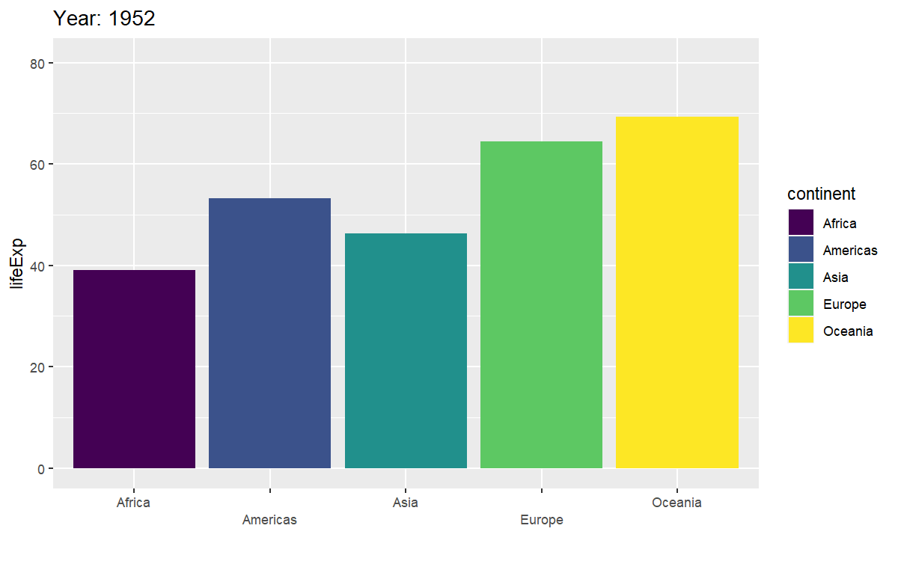

# Advanced data viz

## Intended Learning Outcomes {#ilo-intro}

By the end of this chapter you should be able to:

* Transform simple data sets from wide-form to long-form
* Create and customize advanced types of plots

For the final chapter, we're going to do an adapted version of materials taken from:

> [Nordmann, E., McAleer, P., Toivo, W., Paterson, H. & DeBruine, L. (accepted). Data visualisation using R, for researchers who don't use R. Advances in Methods and Practices in Psychological Science.](https://psyteachr.github.io/introdataviz/)

And:

> * [Applied Data Skils: Customising visualisations](https://psyteachr.github.io/ads-v1/custom.html) (from the PsyTeachR team)

You may find it particularly helpful to read both of these sources in full as a further resource.

## Set-up

Open your course project and do the following:

* Create and save a new R Markdown document named `chapter_5.Rmd`, get rid of the default template text from line 11 onwards.
* Add the below code to the set-up chunk and then run the code to load the packages and data.

```{r warning = FALSE, message=FALSE}
library(tidyverse)
library(patchwork)
library(gapminder)
library(plotly)
library(gganimate)
gapminder_wide <- read_csv(file = "data/gapminder_wide.csv")
```

## Modified Gapminder dataset

The dataset you have loaded is a modified version of the `r pkg("gapminder")` dataset we've used in previous chapters. First, we've reduced the amount of data. The original data set has data every five years from 1952 - 2007 and includes life expectancy, population, and GDP per capita for each country. We've reduced this to just life expectancy from 2002 - 2007 to make it easier to work with as we begin some basic wrangling.

The second change is that the data is structured in `r glossary("wide")` format. Traditionally, researchers have been taught data skills using wide-format data. Wide-format data typically has one row of data for each participant/entity (in this case each country), with separate columns for each score or variable. For repeated-measures variables, the dependent variable is split across different columns. For between-groups variables, a separate column is added to encode the group to which a participant or observation belongs. 

The modified Gapminder data is now in wide format (see Table\ \@ref(tab:wide-data)), where each country's life expectancy is split across two columns for the repeated-measures factor (year). This data structure is typically intuitive for humans to read and enter data into, but the same is not true for a programming language. 

```{r wide-data, echo=FALSE}
head(gapminder_wide) %>% knitr::kable(digits = 2, caption="Data in wide format.")
```

The `r pkg("tidyverse")` and functions like `ggplot()` require data to be in `r glossary("long")` format. Moving from using wide-format to long-format data sets can require a conceptual shift on the part of the researcher and one that usually only comes with practice and repeated exposure. 

Rather than different observations of the same measurement variable being split across columns, there is a single column for the measurement life expectancy, and a single column for the measurement of GDP. Each country however, has multiple rows of data, one for each observation (i.e., for each country there will be as many rows as there are levels of the repeated-measures variable, in this case year). Although there is some repetition of country and continent, each row is unique when looking at the combination of measures.

```{r tidying, echo = FALSE}
gapminder_long <- pivot_longer(gapminder_wide, 
                     cols = lifeExp_2002:lifeExp_2007, 
                     names_to = c("dv", "year"), 
                     names_sep = "_", 
                     values_to = "lifeExp") %>%
  select(-dv)
```

```{r long, echo = FALSE}
head(gapminder_long) %>% knitr::kable(digits = 2, caption = "Data in the correct format for visualization.")
```

It can be initially difficult to figure out how many variables are in your data set and how the long-form structure should look however, a useful rule of thumb when working with data in R for visualization is that *anything that shares an axis should probably be in the same column*. For example, a simple boxplot showing life expectancy by year (collapsing across all countries) would display the variable `year` on the x-axis with bars representing `2002` and `2007` data, and `lifeExp` on the y-axis. Therefore, all the data relating to `year` should be in one column, and all the data relating to `lifeExp` should be in a separate single column, rather than being split like in wide-format data.

### Wide to long format

In this course we have adapted a data set to have a single measurement variable to simplify the data wrangling. In the next course, we'll increase the complexity of the data sets we'll tidy, however, it is worth normalizing that trial-and-error is part of the process of learning how to apply these functions to new data sets and structures. Data visualization can be a useful way to scaffold learning these data transformations because they can provide a concrete visual check as to whether you have done what you intended to do with your data.

#### `pivot_longer()`

The `pivot_longer()` function comes from the `r pkg("tidyverse")` package `r pkg("tidyr")` and is used to transform data from wide-to-long.

-   As with the other tidyverse functions, the first argument specifies the dataset to use as the base, in this case `gapminder_wide`. This argument name is often dropped in examples.

-   `cols` specifies all the columns you want to transform. The easiest way to visualise this is to think about which columns would be the same in the new long-form dataset and which will change. If you refer back to Table\ \@ref(tab:wide-data), you can see that `country` and `continent` remain, while the columns that contain the measurements change. The colon notation `first_column:last_column` is used to select all variables from the first column specified to the last (we only have two columns to select so this doesn't save us any time here but it's useful to know). In our code, `cols` specifies that the columns we want to transform are `lifeExp_2002` to `lifeExp_2007`.

-   `names_to` specifies the name of the new column that will be created. This column will contain the names of the selected existing columns, so we'll call it `year`.

-   Finally, `values_to` names the new column that will contain the values in the selected columns. In this case we'll call it `lifeExp`. 

At this point you may find it helpful to go back and compare `dat` and `long` again to see how each argument matches up with the output of the table.

```{r long1}
gapminder_long <- pivot_longer(gapminder_wide, 
                     cols = lifeExp_2002:lifeExp_2007, 
                     names_to = "year", 
                     values_to = "lifeExp")
```


```{r long1-example, echo = FALSE}
head(gapminder_long) %>% knitr::kable(digits = 2, caption = "Data in long format with messy labels.")
```

#### Step 2: `pivot_longer()` adjusted

The problem with the above long-format data-set is that the values `year` have been taken from the prior column names and they're a bit messy. There's a few different ways we could deal with this, but the option we'll choose is to adjust the arguments to `pivot_longer()`.

First, instead of specifying one name to `names_to`, we're going to tell it to create two columns, `label` and `year`. The additional argument `names_sep` tells R how to split the information between the two columns. This is when taking care to name your variables consistently and meaningfully pays off. Because the word to the left of the separator (`_`) is always the DV label and the word to the right is always the condition of the repeated-measures IV, it is easy to automatically split the columns.

```{r}
gapminder_long <- pivot_longer(data = gapminder_wide, 
                     cols = lifeExp_2002:lifeExp_2007, 
                     names_to = c("label", "year"),
                     names_sep = "_", 
                     values_to = "lifeExp")
```

```{r long-example, echo = FALSE}
head(gapminder_long) %>% knitr::kable(digits = 2, caption = "Data in long format with additional name columns")
```

We can then use `%>%` to add on the `select()` function to drop the column `label` as it's unnecessary.

```{r}
gapminder_long <- pivot_longer(data = gapminder_wide, 
                     cols = lifeExp_2002:lifeExp_2007, 
                     names_to = c("label", "year"),
                     names_sep = "_", 
                     values_to = "lifeExp") %>%
  select(-label)
```

```{r long-example2, echo = FALSE}
head(gapminder_long) %>% knitr::kable(digits = 2, caption = "Data in final long format")
```

We're almost ready for analysis now. One final note, be careful not to calculate demographic descriptive statistics from long-form data sets. Because the process of transformation has introduces some repetition, the wide-format dataset where one row equals one country should be used for demographic information. Now that we have the experimental data in the right form, we can begin to create some useful visualizations. 

## Grouped plots

In the long-form dataset, because each variable has its own column, it's much easier to specify that you want to create grouped plots.

For example, we can create grouped density plots by adding `fill = year` because all the information about `year` is in a single variable, rather than being split across columns.

```{r}
ggplot(gapminder_long, aes(x = lifeExp, fill = year)) +
  geom_density(alpha = 0.75)
```

Or we can create a grouped scatterplot by adding mapping `year` against `lifeExp` and adding `color = continent`. 

```{r}
ggplot(gapminder_long, aes(x = lifeExp, y = year, color = continent)) +
  geom_jitter(height = .1, width = 0) 
```

## Accessible color schemes

One of the drawbacks of using `ggplot2` for visualization is that the default color scheme is not accessible (or visually appealing). The red and green default palette is difficult for color-blind people to differentiate, and also does not display well in greyscale. You can specify exact custom colors for your plots, but one easy option is to use a custom color palette. These take the same arguments as their default `scale` sister functions for updating axis names and labels, but display plots in contrasting colors that can be read by color-blind people and that also print well in grey scale. For categorical colors, the "Set2", "Dark2" and "Paired" palettes from the `brewer` scale functions are colorblind-safe (but are hard to distinguish in grey scale). For continuous colors, such as when color is representing the magnitude of a correlation in a tile plot, the `viridis` scale functions provide a number of different colorblind and grey scale-safe options.

```{r}
ggplot(gapminder_long, aes(x = lifeExp, y = year, color = continent)) +
  geom_jitter(height = .1, width = 0) +
  scale_color_brewer(palette = "Dark2",
                     name = "Continent") +
  theme_minimal()
```

### Grouped violin-boxplots

As with previous plots, another variable can be mapped to `fill` for the violin-boxplot and we can also use `stat_summary()` to add in the mean and error bars. However, simply adding `fill` to the mapping causes the different components of the plot to become misaligned because they have different default positions:

```{r warning = FALSE}
ggplot(gapminder_long, aes(x = continent, y= lifeExp, fill = year)) +
  geom_violin() +
  geom_boxplot(width = .2, 
               fatten = NULL) +
  stat_summary(fun = "mean",  geom = "point") +
  stat_summary(fun.data = "mean_se", 
               geom = "errorbar", 
               width = .1) +
  scale_fill_brewer(palette = "Dark2") +
  theme(legend.position = "bottom")
```

To rectify this we need to adjust the argument `position` for each of the misaligned layers. `position_dodge()` instructs R to move (dodge) the position of the plot component by the specified value; finding what value looks best can sometimes take trial and error.  We can also set the `alpha` values to make it easier to distinguish each layer of the plot.

```{r warning = FALSE}
ggplot(gapminder_long, aes(x = continent, y= lifeExp, fill = year)) +
  geom_violin(position = position_dodge(0.9)) +
  geom_boxplot(width = .2, 
               fatten = NULL,
               position = position_dodge(0.9)) +
  stat_summary(fun = "mean",  geom = "point",
               position = position_dodge(0.9)) +
  stat_summary(fun.data = "mean_se", 
               geom = "errorbar", 
               width = .1,
               position = position_dodge(0.9)) +
  scale_fill_brewer(palette = "Dark2") +
  theme(legend.position = "bottom")

```

### Complex layer plots

A more complex plot can be produced that takes advantage of the layers to visualize not only the overall interaction, but the change across repeated-measures conditions.

This code is more complex than all prior code because it does not use a universal mapping of the plot aesthetics. In our code so far, the aesthetic mapping (`aes`) of the plot has been specified in the first line of code because all layers used the same mapping. However, is is also possible for each layer to use a different mapping -- we encourage you to build up the plot by running each line of code sequentially to see how it all combines.

-   The first call to `ggplot()` sets up the default mappings of the plot that will be used unless otherwise specified - the `x`, `y` and `group` variable. Note the addition  of `shape`, which will vary the shape of the geom according to the `year` variable.
-   `geom_point()` overrides the default mapping by setting its own `colour` to draw the data points from each `continent` in a different color. `alpha` is set to a low value to aid readability. 
-   Similarly, `geom_line()` overrides the default grouping variable so that a line is drawn to connect the individual data points for each *country* (`group = country`) rather than each `year`, and also sets the colors.  
-   Finally, the calls to `stat_summary()` remain largely as they were, with the exception of setting `colour = "black"` and `size = 2` so that the overall means and error bars can be more easily distinguished from the individual data points. Because they do not specify an individual mapping, they use the defaults (e.g., the lines are connected by `continent`). For the error bars, the lines are again made solid.

```{r figure30, fig.cap="Complex layered plot with by-country data."}
ggplot(gapminder_long, aes(x = year, y = lifeExp, 
                     group = continent, shape = continent)) +
  # adds raw data points in each condition
  geom_point(aes(colour = continent),alpha = .4) +
  # add lines to connect each participant's data points across conditions
  geom_line(aes(group = country, colour = continent), alpha = .6) +
  # add data points representing cell means
  stat_summary(fun = "mean", geom = "point", size = 2, colour = "black") +
  # add lines connecting cell means by condition
  stat_summary(fun = "mean", geom = "line", colour = "black") +
  # add errorbars to cell means
  stat_summary(fun.data = "mean_se", geom = "errorbar", 
               width = .1, colour = "black") +
  # change colours and theme
  scale_color_brewer(palette = "Paired") +
  theme_minimal() +
  theme(legend.position = "bottom") 

```

## Facets

There are situations in which it may be useful to create separate plots for each level of a variable using facets. This can also help with accessibility when used instead of or in addition to group colors. The below code is an adaptation of the code used to produce the histogram in which it may be easier to see how the relationship changes when the data are not overlaid.

Additionally, previously when we edited the main axis labels we used the `scale_*` functions. These functions are useful to know because they allow you to customize many aspects of the scale, such as the breaks and limits. However, if you only need to change the main axis `name`, there is a quicker way to do so using `labs()` which can be used to add or remove (by specifying `NULL`) for the axis you want to rename:

```{r figure31, fig.cap="Faceted histogram", warning = FALSE}
ggplot(gapminder_long, aes(x = lifeExp)) +
  geom_histogram(colour = "black") +
  facet_wrap(~continent, nrow = 5) +
  guides(fill = "none")+
  theme_minimal() +
  labs(y = NULL, title = "Life Expectancy by Continent")
```

## Redundant aesthetics

So far when we have produced plots with colors, the colors were the only way that different levels of a variable were indicated, but it is sometimes preferable to indicate levels with both color and other means, such as facets or x-axis categories.

The code below adds `fill = continent` to the histograms and use the Viridis color palette to customize the colors. Specifying a `fill` variable means that by default, R produces a legend for that variable. 

```{r warning=FALSE, fig.cap="Faceted histogram with redundant legend", warning = FALSE}
ggplot(gapminder_long, aes(x = lifeExp, fill = continent)) +
  geom_histogram(colour = "black") +
  facet_wrap(~continent, nrow = 5) +
  scale_fill_viridis_d() +
  theme_minimal() +
  labs(y = NULL, title = "Life Expectancy by Continent")
```

However, the use of color is redundant with the facet labels, so you can remove this legend with the `guides` function to make better use of the plot space:

```{r warning=FALSE, fig.cap="Faceted histogram with redundant legend removed", warning = FALSE}
ggplot(gapminder_long, aes(x = lifeExp, fill = continent)) +
  geom_histogram(colour = "black") +
  facet_wrap(~continent, nrow = 5) +
  scale_fill_viridis_d() +
  guides(fill = "none")+
  theme_minimal() +
  labs(y = NULL, title = "Life Expectancy by Continent")
```

## Advanced Plots

For the advanced plots, we will use some custom functions: `geom_split_violin()` and `geom_flat_violin()`, which you can access through the `introdataviz` package. These functions are modified from [@raincloudplots].

```{r, eval = FALSE}
# how to install the introdataviz package to get split and half violin plots
devtools::install_github("psyteachr/introdataviz")

# if you get the error "there is no package called "devtools" run:
# install.packages("devtools") 

```

### Split-violin plots

Split-violin plots remove the redundancy of mirrored violin plots and make it easier to compare the distributions between multiple conditions. For this plot we'll also use the function `filter()` to just keep the data from Africa and Asia. The `%in%` notation means that it will retain any values that match one of the possibilities presented: 

```{r}
gapminder_long %>%
  filter(continent %in% c("Africa", "Asia")) %>%
  ggplot(aes(x = year, y= lifeExp, fill = continent)) +
  introdataviz::geom_split_violin(alpha = .4) +
  geom_boxplot(width = .2, position = position_dodge(.4)) +
  scale_fill_brewer(palette = "Paired") +
  theme(legend.position = "bottom") +
  labs(fill = NULL) +
  theme_minimal() +
  theme(legend.position = "bottom")
```

### Raincloud plots

Raincloud plots combine a density plot, boxplot, raw data points, and any desired summary statistics for a complete visualization of the data. They are so called because the density plot plus raw data is reminiscent of a rain cloud. The point and line in the center of each cloud represents its mean and 95% CI. The rain represents individual data points.

This is an incredibly advanced plot and we don't expect that you would be able to create this on your own from scratch at this point in your training. However, hopefully you should now have a sense of how the plot has built up and how the layers are working together.

```{r}

rain_height <- .1

gapminder_long %>%
  filter(continent %in% c("Americas", "Asia")) %>%
  ggplot(aes(x = "", y = lifeExp, fill = year)) +
  # clouds
  introdataviz::geom_flat_violin(alpha = 0.6,
    position = position_nudge(x = rain_height+.05)) +
  # rain
  geom_point(aes(colour = year), size = 2, alpha = .7, 
              position = position_jitter(width = rain_height, height = 0)) +
  # boxplots
  geom_boxplot(width = rain_height, alpha = 0.4, 
               position = position_nudge(x = -rain_height*2)) +
  # mean and SE point in the cloud
  stat_summary(fun.data = mean_cl_normal, 
               mapping = aes(color = year), 
               position = position_nudge(x = rain_height * 3)) +
  # adjust layout
  scale_x_discrete(name = "", expand = c(rain_height*3, 0, 0, 0.7)) +
  coord_flip() +
  facet_wrap(~continent, nrow = 2) +
  # custom colours and theme
  scale_fill_brewer(palette = "Accent", name = "Continent") +
  scale_colour_brewer(palette = "Accent") +
  theme_minimal() +
  theme(panel.grid.major.y = element_blank(),
        legend.position = c(0.2, 0.8),
        legend.background = element_rect(fill = "white", color = "white")) +
  guides(fill = "none")
```

### Interactive plots

The `r pkg("plotly")` package can be used to make interactive graphs. Assign your ggplot to a variable and then use the function `ggplotly()` on the plot object. Note that interactive plots only work in HTML files, not PDFs or Word files and that some advanced types of plots won't render well (e.g., it struggles with the raincloud plot).

For example, let's create the grouped scatterplot of life expectancy by year and continent again:

```{r plotly, message = FALSE, fig.cap="Interactive graph using plotly"}
point_plot <- ggplot(gapminder_long, aes(x = lifeExp, 
                                         y = year, 
                                         color = continent)) +
  geom_jitter(height = .1, width = 0) 

ggplotly(point_plot)
```

::: {.info data-latex=""}
Hover over the data points above and click on the legend items.
:::

However, we can also add in some extra information to take advantage of the interactive plot. We'll add `fill = country` to the aesthetic mapping. We don't actually want to display this in the main plot, we just want `plotly` to have this variable available to it so we'll also add `guides(fill = "none")` to avoid creating a huge legend. The static version of this plot looks identical but if you pass it it to `ggplotly()` you'll now see that you can identify not only the continent but the country of each data point.

```{r}
country_plot <- ggplot(gapminder_long, aes(x = lifeExp, 
                                         y = year, 
                                         color = continent,
                                         fill = country)) +
  geom_jitter(height = .1, width = 0) +
  guides(fill = "none")

ggplotly(country_plot)

```

### Animated Plots

Finally, animated plots are a great way to add a wow factor to your reports, but they can be complex to make, distracting, and not very accessible, so use them sparingly and only for data visualization where the animation really adds something. The package `r pkg("gganimate", "https://gganimate.com/")` has many functions for animating ggplots.

Here, we'll use the original Gapminder data that has life expectancy for every five years from 1952, not just 2002 and 2007.

```{r}
data("gapminder")
```

Let's make an animated plot showing how life expectancy in each region changes with year. First, make a static plot. Filter the data to the most recent year so you can see what a single frame of the animation will look like.

```{r}
gapminder %>%
  filter(year == 2007) %>%
  ggplot(aes(x = continent, y = lifeExp, fill = continent)) +
  stat_summary(fun = "mean", geom = "bar") +
  scale_fill_viridis_d() +
  scale_x_discrete(name = "", 
                   guide = guide_axis(n.dodge=2)) +
  ggtitle('Year: 2007')
```

To convert this to an animated plot that shows the data from multiple years:

* Remove the filter and add `transition_time(year)`. 
* Use the `{}` syntax to include the `frame_time` in the title. 
* Use `anim_save()` to save the animation to a GIF file and set this code chunk to `eval = FALSE` because creating an animation takes a long time and you don't want to have to run it every time you knit your report.


```{r, eval = FALSE}
anim <- gapminder %>%
  ggplot(aes(x = continent, y = lifeExp, fill = continent)) +
  stat_summary(fun = "mean", geom = "bar") +
  scale_fill_viridis_d() +
  scale_x_discrete(name = "",
                   guide = guide_axis(n.dodge=2))+ 
  ggtitle('Year: {frame_time}') +
  transition_time(year)
  
dir.create("images", FALSE) # creates an images directory if needed

anim_save(filename = "book/images/gganim-demo.gif",
          animation = anim,
          width = 8, height = 5, units = "in", res = 150)
```

You can show your animated gif in an html report (animations don't work in Word or a PDF) using `include_graphics()`, or include the GIF in a dynamic document like PowerPoint.

```{r anim-demo, fig.cap="Animated gif."}

```

::: {.warning data-latex=""}
There are actually not many plots that are really improved by animating them. The plot below gives the same information at a single glance.

```{r anim-alternative, echo = FALSE}
gapminder %>%
  ggplot(aes(x = year, y = lifeExp, color = continent)) +
  stat_summary(fun = "mean", geom = "point") +
  stat_summary(fun = "mean", geom = "line") +
  scale_x_continuous(name = "", 
                     breaks = seq(1952, 2007, 5)) +
  scale_color_viridis_d() +
  ggtitle("Average life expectancy by continent from 1952 to 2007") +
  labs(color = NULL) +
  theme_minimal()
```

:::

## End of course

And we're done! Our aim with this course isn't for you to be fully proficient in R at this point. If you're new to coding, it's entirely unrealistic and unhelpful for any course to claim that you can fully learn to code in the space of a couple of weeks. Instead, we hope that we have demystified some of the many unwritten (or badly explained) rules and conventions you need to know to use R so that you have the tools to continue learning R more independently.

### Next steps

In this course, we focused heavily on data visualization because it provides a concrete, tangible output for your efforts. This is great for beginners because it helps map the code to the output, but also if you're anything like Emily, making pretty graphs is motivating. Our second course "Data wrangling and analysis" (due to run in Feb 2023) will build on the skills you've learned here and go deeper into how to clean, wrangle, and process your data, as well as how to perform some basic regression analyses.  

In the meantime, if you'd like to continue learning we'd suggest the following steps:

* Review the initial chapters of this book. Now you have hands-on experience with R, some of the information about functions and packages is likely to make a lot more sense.
* Review the further resources provided at the end of each chapter. In particular, if you would like another online book to work through, we'd highly recommend [R for Data Science](https://r4ds.had.co.nz/), [R for Health Data Science](https://argoshare.is.ed.ac.uk/healthyr_book/), and the collection of materials provided by the [PsyTeachR team](https://psyteachr.github.io/).
* Practice the skills and functions used in this course with different data sets. These could either be your own data sets or open data you find online or from R packages. If you have to do a little bit of wrangling in Excel to get the data in the format you need, don't feel bad - whatever gets you coding is a good thing and eventually you'll be able to have your entire workflow in R.

## Further Resources {#resources-viz}

* [Applied Data Skils: Data visualisation](https://psyteachr.github.io/ads-v1/viz.html) (from the PsyTeachR team)
* [Applied Data Skils: Customising visualisations](https://psyteachr.github.io/ads-v1/custom.html) (from the PsyTeachR team)
* [ggplot2 cheat sheet](https://raw.githubusercontent.com/rstudio/cheatsheets/main/data-visualization.pdf)
* [Data visualisation using R, for researchers who don't use R](https://psyteachr.github.io/introdataviz/)
* [Chapter 3: Data Visualisation](http://r4ds.had.co.nz/data-visualisation.html) of *R for Data Science*
* [ggplot2 FAQs](https://ggplot2.tidyverse.org/articles/)
* [ggplot2 documentation](https://ggplot2.tidyverse.org/reference/)
* [Chapter 28: Graphics for communication](http://r4ds.had.co.nz/graphics-for-communication.html) of *R for Data Science*
* [gganimate](https://gganimate.com/): A package for making animated plots
* [The R Graph Gallery](http://www.r-graph-gallery.com/) (this is really useful)
* [Look at Data](https://socviz.co/lookatdata.html) from [Data Vizualization for Social Science](http://socviz.co/)
* [Graphs](http://www.cookbook-r.com/Graphs) in *Cookbook for R*
* [R Graphics Cookbook](http://www.cookbook-r.com/Graphs/) by Winston Chang
* [ggplot extensions](https://exts.ggplot2.tidyverse.org/)
* [plotly](https://plot.ly/ggplot2/) for creating interactive graphs
