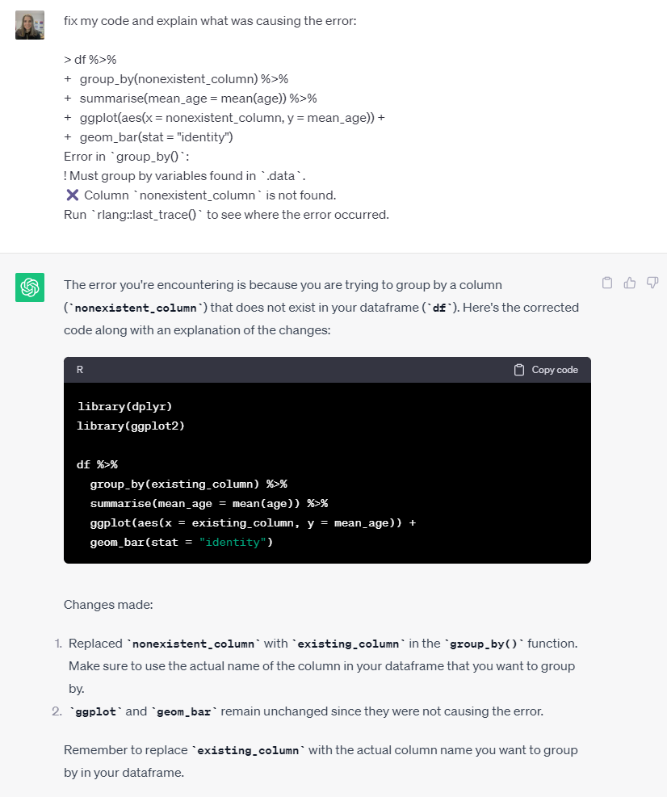
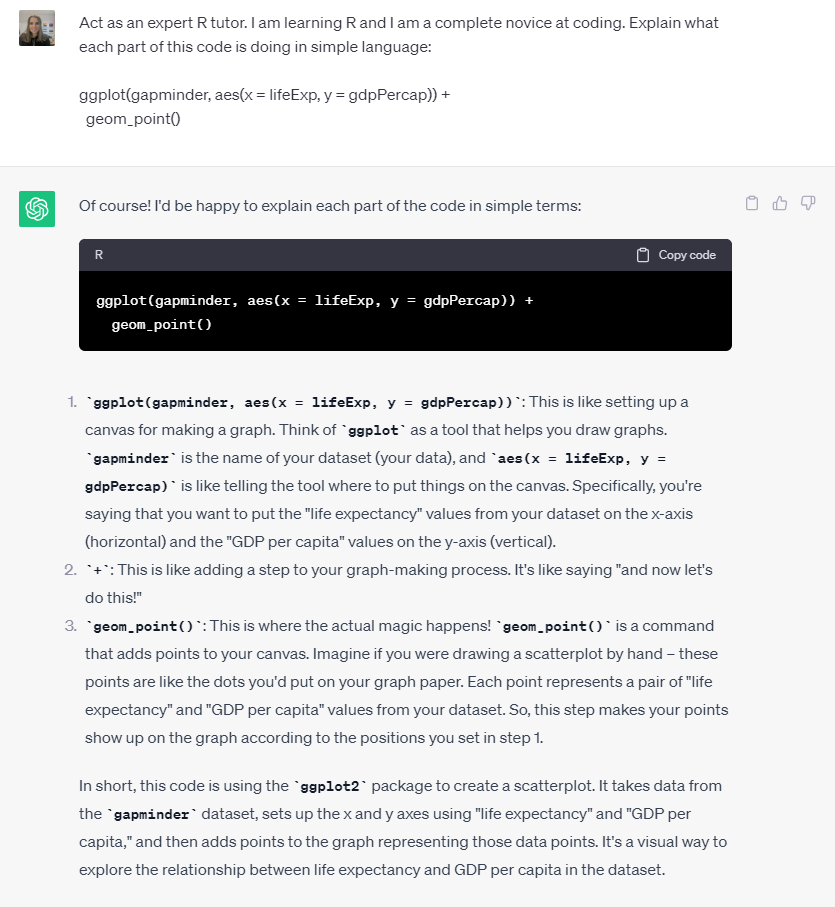
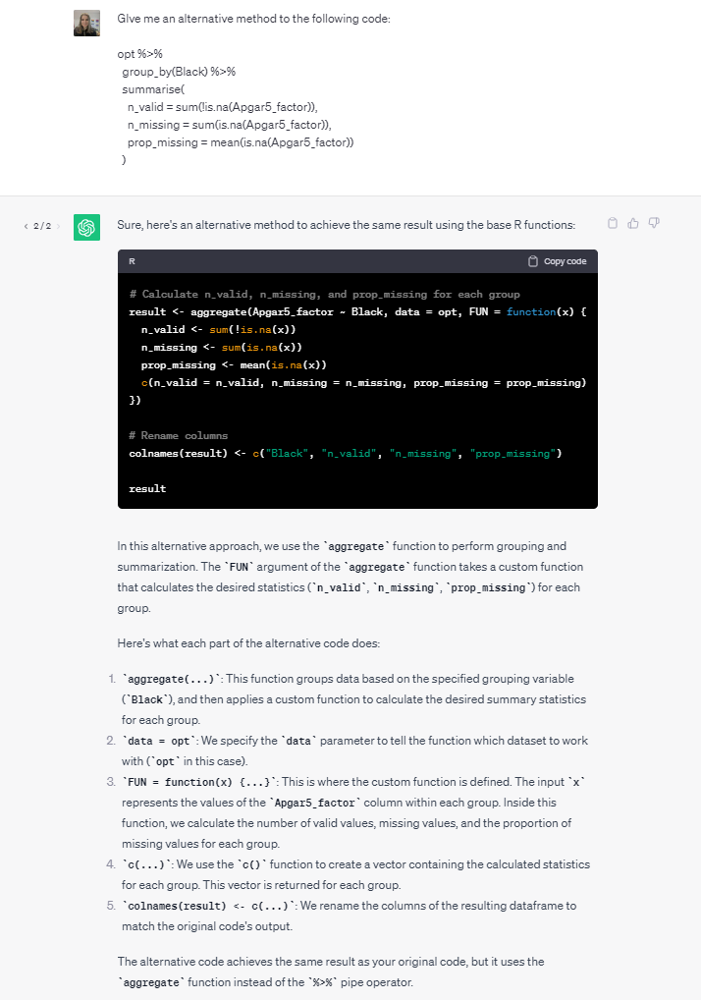

# AI and coding

AI tools like ChatGPT have exploded in functionality and popularity over the last year or so. In this section we'll give you some advice for how to use ChatGPT to help support your coding, although with a caveat that the AI landscape is still very new and continually evolving and we're all still learning! If you have any suggestions for advice to add to this chapter or resources, please let us know. This guidance will be based on using ChatGPT as that's the platform we're most familiar with but this guidance will likely apply to other platforms.

## Debugging

You can use ChatGPT to help you debug errors in your code. Give ChatGPT the code you used and the error and ask it to fix your code and also explain what caused the error. This second part is really important, don't just blindly copy and paste code from ChatGPT without understanding the code it provides. Whilst it's pretty good, particularly at simple tasks, you cannot run the risk that it will give you code

## R tutor

You can also use ChatGPT as a tutor to give you additional explanations if you don't understand something in the course materials. To make this more useful, tell ChatGPT how you want it to act ("act like an expert R tutor") and also tell it about yourself and what level of explanation you'd like (e.g., I am a complete novice, I know python, explain it in simple terms, explain in technical terms). This way you can tailor the help it provides to your knowledge and skills.

## Alternative methods

One of the things that can make R difficult to learn is that there's always multiple ways of achieving the same goal. This can also make looking up help difficult because the solutions you find might be written in a different style (e.g., Base R vs tidyverse). You can use ChatGPT to identify alternative approaches - you don't need to necessarily use them, but it can be useful to help learn about new packages or approaches. You could ask it for a specific alternate approach ("give me an alternative solution using base R functions") or you could just ask it for alternative solution and see what it produces and use the "regenerate" function to see even more examples.

## Writing code

As well as helping to debug and explain code you've written, you can also ask ChatGPT to write code for you from scratch but this comes with more caveats.

* ChatGPT does not have access to the most recent versions of packages and functions which means the code it writes for you may be outdated. This could either mean it will not work with the package version you have, or it might be that there are newer packages and functions that would be more efficient that it won't know about.
* As already noted, never copy and past code you don't understand. You should always be able to verify any code it produces for you - I imagine that the clock is ticking on when we'll start hearing about papers being retracted because the analysis code doesn't actually do what the authors thought it did.
* Whilst ChatGPT is quite good at writing code for simple tasks, the more complicated your request, the more likely it is that the code it provides won't work for you first time. If you're learning R as a complete novice, what this means is that whilst you should use ChatGPT to help support your learning, there's only so many shortcuts you can take before it will actually impede your progress in the long-run. Don't skip learning the basics because you're going to need those skills to take advantage of ChatGPT - make no mistake, it can super-charge your coding and massively speed things up but without a solid understanding of the basics, something **will** go seriously wrong sooner or later.
* It will sometimes hallucinate (generate false information) packages and functions that do not exist. This is another good reason not to skip having a solid foundation of knowledge, you'll be able to spot much more quickly when it gives you these errors.

When writing prompts to produce code for you, give it as much information as you can:

* If you can, tell ChatGPT which packages and functions you want to use to achieve your task.
* Specify the names of datasets, variables, and any other information you can give it. 
* If you're running statistical analyses, give it as much information about how you want it to run the analysis. If you're not sure what information might be useful, ask it to ask you questions about how to perform the analysis before it does it.
* Ask it to explain what each piece of the code is doing so that you can better understand it and sot any potential errors.

You can see examples of the differences in output via the following ChatGPT links:

* [Request for basic linear regression model](https://chat.openai.com/share/b6a1560a-a4ab-442f-9392-f0a55a06ed56)
* [Request for ordinal regression model with specific information about the dataset and approach to take](https://chat.openai.com/share/52cd538d-0968-409c-bd72-71fcac28cbd7)

