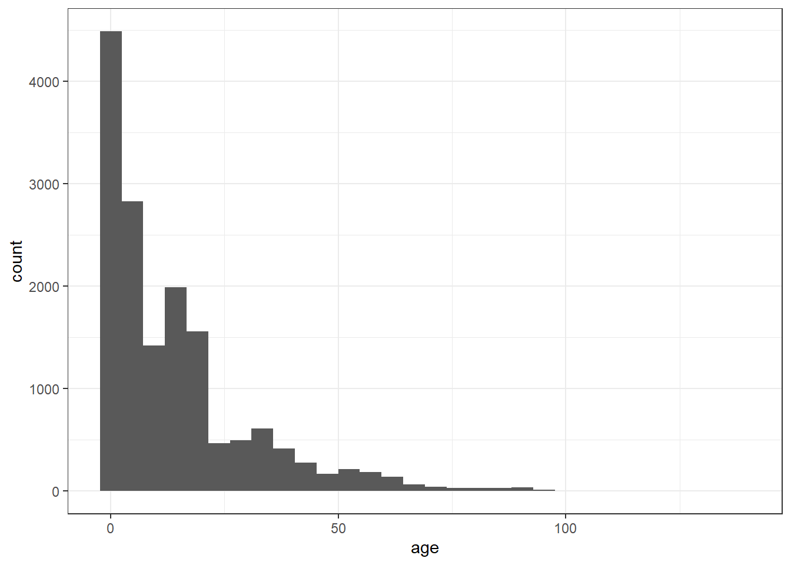
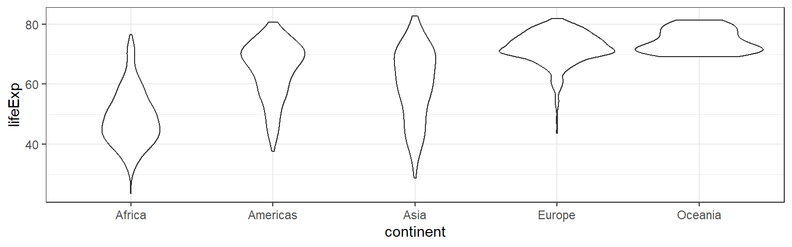

# Intro to data viz {#intro-viz}

## Intended Learning Outcomes {#ilo-viz}

By the end of the chapter you should be able to:

* Create and manage projects
* Understand the grammar of ggplot
* Produce and customize a range of visualizations

This is the longest chapter in the course. If you've got some experience with RStudio you'll likely progress quite quickly through the first section that deals with projects and loading data. If you're completely new to R, you might want to plan to do this chapter in two sessions

## Reading

Before you work through this chapter, read [Principles of Effective Data Visualisation](https://www.cell.com/patterns/fulltext/S2666-3899(20)30189-6).

## Walkthrough video

We encourage you to read the workbook and attempt each step on your own before watching the video as this will help consolidate your learning. 

<iframe width="560" height="315" src="https://www.youtube.com/embed/UMIq9h8Di8k" title="YouTube video player" frameborder="0" allow="accelerometer; autoplay; clipboard-write; encrypted-media; gyroscope; picture-in-picture" allowfullscreen></iframe>

## Organising a project {#projects}

Before we write any code, first, we need to get organised. <a class='glossary' target='_blank' title='A way to organise related files in RStudio' href='https://psyteachr.github.io/glossary/p#project'>Projects</a> in RStudio are a way to group all the files you need for one project. Most projects include scripts, data files, and output files like the PDF report created by the script or images.

The folder that R will look in by default to find and save files is known as the <a class='glossary' target='_blank' title='The filepath where R is currently reading and writing files.' href='https://psyteachr.github.io/glossary/w#working-directory'>working directory</a>. You can set the working directory manually to the folder you want to work in with menu commands:

-   **`Session > Set Working Directory > Choose Directory...`**

However, there's a better way of organizing your files by using Projects in RStudio. How you set-up a new project depends on whether you're working from a local installation or on RStudio Cloud.

### Start a Project (local) {#project-start}

To create a new project for a local installation:

-   **`File > New Project...`**
-   Name the project <code class='path'>intro-to-r</code>
-   Save it somewhere sensible on your computer.

RStudio will restart itself and open with this new project directory as the working directory.

<div class="figure" style="text-align: center">

<p class="caption">(\#fig:unnamed-chunk-1)Starting a new project.</p>
</div>

### Start a Project (cloud)

If you're working on the cloud:

- **`New project > New RStudio Project`**
- Wait for the project to initialise
- Name the project <code class='path'>intro-to-r</code> by clicking on the name of the project (by default "Untitled project") at the top.

<div class="figure" style="text-align: center">

<p class="caption">(\#fig:unnamed-chunk-2)Starting a new project in the cloud.</p>
</div>

For both a local and cloud project, click on the Files tab in the lower right pane to see the contents of the project directory. You will see a file called `intro-to-r.Rproj`, which is a file that contains all of the project information. You can double-click on it to open up the project.

::: {.info data-latex=""}
Depending on your settings, you may also see a directory called `.Rproj.user`, which contains your specific user settings. You can ignore this and other "invisible" files that start with a full stop.
:::

## R Markdown {#rmarkdown}

For this course we will use <a class='glossary' target='_blank' title='The R-specific version of markdown: a way to specify formatting, such as headers, paragraphs, lists, bolding, and links, as well as code blocks and inline code.' href='https://psyteachr.github.io/glossary/r#r-markdown'>R Markdown</a> to write and save our code in, which is similar to the Jupyter notebooks that the workbench uses. We won't have time to cover too many of the features of R Markdown but it's an incredibly powerful format that allows you to create fully reproducible reports where all text, code, and analysis is contained within the one document. You can also use it to create websites, online books (like this one), presentations, and Shiny apps. If you'd like to learn more about R Markdown, there's links to additional resources in Section \@ref(resources-viz).

### New document

To open a new R Markdown document click:

-   **`File > New File > R Markdown`**

You will be prompted to give it a title; call the document `Intro to data viz`. You can also change the author name. Keep the output format as HTML.

Once you've opened a new document be sure to save it by clicking **`File > Save As...`**. Name this file something sensible like `chapter_3` (if you are on a Mac and can see the file <a class='glossary' target='_blank' title='The end part of a file name that tells you what type of file it is (e.g., .R or .Rmd).' href='https://psyteachr.github.io/glossary/e#extension'>extension</a>, name it `chapter_3.Rmd`). This file will automatically be saved in your project folder, i.e., your working directory, so you should now see this file appear in your file viewer pane.

When you first open a new R Markdown document you will see a bunch of welcome text that looks like this:

<div class="figure" style="text-align: center">

<p class="caption">(\#fig:img-markdown-default)New R Markdown text</p>
</div>

Click **knit** to see what this template looks like when it has been rendered, then, do the following steps:

-   Delete **everything** after the setup chunk
-   Skip a line after the setup chunk and type "## Loading packges" (with the hashes but without the quotation marks); make sure there are no spaces before the hashes and at least one space after the hashes before the subtitle
-   Skip a line and click the insert new code menu (a green box with a C and a plus sign) then **`R`**

### Code chunks {#code-chunks}

What you have created is a subtitle and a **code chunk**. In R Markdown, anything written in a grey code chunk is assumed to be code, and anything written in the white space (between the code chunks) is regarded as normal text (the actual colours will depend on which theme you have applied, but we will refer to the default white and grey). This makes it easy to combine both text and code in one document.

::: {.dangerous data-latex=""}
When you create a new code chunk you should notice that the grey box starts and ends with three back ticks \`\`\`. One common mistake is to accidentally delete these back ticks. Remember, code chunks and text entry are different colours - if the colour of certain parts of your Markdown doesn't look right, check that you haven't deleted the back ticks.
:::

In your code chunk, write the code to load some of the packages that you installed Section \@ref(packages) 


```r
library(tidyverse)
library(patchwork)
library(ggthemes)
library(medicaldata)
library(gapminder)
```

### Running code

When you're working in an R Markdown document, there are several ways to run your lines of code.

1.  First, you can highlight the code you want to run and then click `Run` -\> `Run Selected Line(s)`, however this is tedious and can cause problems if you don't highlight *exactly* the code you want to run. This is the most common method of running code we see with beginners, but you should aim to make your life easier and **don't do this**

2.  Alternatively, you can press the green "play" button at the top-right of the code chunk and this will run **all** lines of code in that chunk.

3.  Even better is to learn some of the [keyboard short cuts](https://support.rstudio.com/hc/en-us/articles/200711853-Keyboard-Shortcuts-in-the-RStudio-IDE) for R Studio. To run a single line of code, make sure that the cursor is in the line of code you want to run (it can be anywhere) and press `ctrl + enter` or `Cmd + enter` if you're on a Mac. If you want to run all of the code in the code chunk, press `ctrl/cmd + shift + enter`. Learn these short cuts, they will make your life easier! 

Run your code using method 3. You should see the packages load in the console.

## Loading data

If you're using the *All of Us* Researcher Workbench, you'll load in the data from the Researcher Workbench but it's useful to know how to import data into R more generally. Broadly speaking there are three types of data you can load when working in R:

1.  Built-in data sets that come with the packages you install that are useful for reproducible demos. Common ones you will see when you Google help documentation are `mtcars` and `diamonds` but we'll be using datasets from the `medicaldata` package that are built specifically for teaching data skills to health researchers.
2.  Data sets stored online and accessed via a URL.
3.  Data sets stored locally on your computer.

We'll start with 1 and move to 2 and 3 soon.

### Built-in data

The <code><span class='fu'><a target='_blank' href='https://rdrr.io/r/utils/data.html'>data</a></span><span class='op'>(</span><span class='op'>)</span></code> function lists the data sets available.


```r
# list datasets built in to base R and all installed packages
data()

# lists datasets in a specific package
data(package = "medicaldata")
```

Type the name of a data set into the <a class='glossary' target='_blank' title='The pane in RStudio where you can type in commands and view output messages.' href='https://psyteachr.github.io/glossary/c#console'>console</a> to see the data. For example, type `?covid_testing` into the console to see the dataset description for `covid_testing`, which is a data set included with <code class='package'>medicaldata</code>.


```r
?covid_testing                
```

You can also use the <code><span class='fu'><a target='_blank' href='https://rdrr.io/r/utils/data.html'>data</a></span><span class='op'>(</span><span class='op'>)</span></code> function to load a dataset into your <a class='glossary' target='_blank' title='The interactive workspace where your script runs' href='https://psyteachr.github.io/glossary/g#global-environment'>global environment</a>.


```r
# loads covid testing data into the environment
data("covid_testing")
```

You can now use this data. Insert a new heading (\##) named "My first plot". The underneath it, create a new code chunk, and copy, paste, and run the below code. You may not understand this yet, but you will by the end of the session.


```r
ggplot(covid_testing, aes(x = pan_day)) +
  geom_histogram(colour = "black") +
  theme_economist() +
  labs(title = "COVID-19 cases",
       y = "Number of cases", x = "Day after pandemic")
```

### Online sources {#loading-online}

Now, let's try loading data that is stored online. Create a code chunk in your document and copy, paste, and run the below code. This code loads the `gapminder` dataset that is contained in the <code class='package'>gapminder</code> package, except we've saved it as a `.csv` file and uploaded it to GitHub for the purposes of this exercise. The dataset contains an excerpt of the Gapminder data on life expectancy, GDP per capita, and population by country from 1952 to 2007.

-   The data is stored in a `.csv` file so we're going to use the `read_csv()` function to load it in.
-   Note that the url is contained within double quotation marks - it won't work without this.


```r
# read in data
gapminder <- read_csv("https://raw.githubusercontent.com/emilynordmann/AllOfUs-intro-to-r/main/book/data/gapminder.csv")
```

::: {.warning data-latex=""}
If you get an error message that looks like:

> Error in read_csv("https://raw.githubusercontent.com/emilynordmann/AllOfUs-intro-to-r/main/book/data/gapminder.csv") :\
> could not find function "read_csv"

This means that you have not loaded tidyverse. Check that `library(tidyverse)` is in the setup chunk and that you have run the setup chunk.
:::

Create another heading (\##) named "My second plot", another code chunk below it, and copy, paste, and run the code below.


```r
ggplot(gapminder, aes(x = continent, y = lifeExp)) +
  geom_boxplot() +
  theme_excel() +
  labs(y = "Life Expectancy",
       title = "Life Expectancy by Continent",
       subtitle = "1952 - 2007",
       x = NULL) +
  theme(legend.position = "bottom")
```

## Knitting your file {#rmd-knit}

Before we move on to focus on visualisation, we are going to <a class='glossary' target='_blank' title='To create an HTML, PDF, or Word document from an R Markdown (Rmd) document' href='https://psyteachr.github.io/glossary/k#knit'>knit</a>, or compile, the file into a document type of our choosing. To knit your file click:

-   **`Knit > Knit to HMTL`**

R Markdown will create and display a new HTML document, but it will also automatically save this file in your working directory.

::: {.info data-latex=""}
You can also knit by typing the following code into the console. Never put this in an Rmd script itself, or it will try to knit itself in an infinite loop.


```r
rmarkdown::render("chapter_3.Rmd")

# alternatively, you can use this, but may get a warning
knitr::knit2html("chapter_3.Rmd")
```
:::

We don't have time to cover how to customise the knitted output in this course, but suffice to say that you can control almost every aspect, from whether the code is displayed or hidden, to the size and placement of the figures.

As you work through this course, we encourage you to use the Markdown document to take notes on the code and the output you create so that you have a complete single record of the work you've done. In particular, use headings and new code chunks to separate tasks, and if (when) you experience an error, make a note of how you fixed it.

Ok, let's get started properly.

## Building plots

There are multiple approaches to data visualization in R; in this course we will use the popular package <code class='package'>ggplot2</code>, which is part of the larger `tidyverse` collection of packages. A grammar of graphics (the "gg" in "ggplot") is a standardised way to describe the components of a graphic. <code class='package'>ggplot2</code> uses a layered grammar of graphics, in which plots are built up in a series of layers. It may be helpful to think about any picture as having multiple elements that sit semi-transparently over each other. A good analogy is old animated movies where artists would create a background and then add moveable elements on top of the background via transparencies.

Figure \@ref(fig:layers) displays the evolution of a simple scatterplot using this layered approach. First, the plot space is built (layer 1); the variables are specified (layer 2); the type of visualisation (known as a `geom`) that is desired for these variables is specified (layer 3) - in this case `geom_point()` is called to visualise individual data points; a second geom is added to include a line of best fit (layer 4), the axis labels are edited for readability (layer 5), and finally, a theme is applied to change the overall appearance of the plot (layer 6).

<div class="figure" style="text-align: center">

<p class="caption">(\#fig:layers)Evolution of a layered plot</p>
</div>

Importantly, each layer is independent and independently customizable. For example, the size, color and position of each component can be adjusted, or one could, for example, remove the first geom (the data points) to only visualize the line of best fit, simply by removing the layer that draws the data points (Figure \@ref(fig:remove-layer)). The use of layers makes it easy to build up complex plots step-by-step, and to adapt or extend plots from existing code.

<div class="figure" style="text-align: center">

<p class="caption">(\#fig:remove-layer)Final plot with scatterplot layer removed.</p>
</div>

## Plot setup

### Data {#plot-setup-data}

Every plot starts with the `ggplot()` function and a data table. If your data are not loaded or you have a typo in your code, this will give you an error message. It's best to check your plot after each step, so that you can figure out where errors are more easily.


```r
ggplot(data = gapminder)
```

<div class="figure" style="text-align: center">

<p class="caption">(\#fig:build-plot-setup)A blank ggplot.</p>
</div>

### Mapping

The next <a class='glossary' target='_blank' title='A variable that provides input to a function.' href='https://psyteachr.github.io/glossary/a#argument'>argument</a> to `ggplot()` is the `mapping`. This tells the plot which columns in the data should be represented by, or "mapped" to, different aspects of the plot, such as the x-axis, y-axis, line colour, object fill, or line style. These aspects, or "aesthetics", are listing inside the `aes()` function.

Set the arguments `x` and `y` to the names of the columns you want to be plotted on those axes. Here, we want to plot the wait time on the x-axis and the call time on the y-axis.


```r
# set up the plot with mapping
ggplot(
  data = gapminder, 
  mapping = aes(x = lifeExp, y = gdpPercap)
)
```

<div class="figure" style="text-align: center">

<p class="caption">(\#fig:build-plot-mapping)A blank plot with x- and y- axes mapped.</p>
</div>

::: {.info data-latex=""}
In the example above, we wrote out the names of the <a class='glossary' target='_blank' title='A variable that provides input to a function.' href='https://psyteachr.github.io/glossary/a#argument'>arguments</a> `data` and `mapping`, but in practice, almost everyone omits them. Just make sure you put the data and mapping in the right order.


```r
ggplot(gapminder,  aes(lifeExp, gdpPercap))
```
:::

### Geoms

Now we can add our plot elements in layers. These are referred to as <a class='glossary' target='_blank' title='The geometric style in which data are displayed, such as boxplot, density, or histogram.' href='https://psyteachr.github.io/glossary/g#geom'>geoms</a> and their functions start with `geom_`. You **add** layers onto the base plot created by `ggplot()` with a plus (`+`).


```r
ggplot(gapminder, aes(x = lifeExp, y = gdpPercap)) +
  geom_point() # scatterplot
```

<div class="figure" style="text-align: center">

<p class="caption">(\#fig:build-plot-geoms)Adding a scatterplot with geom_point().</p>
</div>

::: {.warning data-latex=""}
Somewhat annoyingly, the plus has to be on the end of the previous line, not at the start of the next line. If you do make this mistake, it will run the first line of code to produce the base layer but then you will get the following error message rather than adding on `geom_point()`.


```r
ggplot(gapminder, aes(x = lifeExp, y = gdpPercap)) 
```


```r
+ geom_point() # scatterplot
```

```
## Error:
## ! Cannot use `+.gg()` with a single argument. Did you accidentally put + on a new line?
```
:::

### Multiple geoms

Part of the power of <code class='package'>ggplot2</code> is that you can add more than one geom to a plot by adding on extra layers and so it quickly becomes possible to make complex and informative visualisations. Importantly, the layers display in the order you set them up. The code below uses the same geoms to produce a scatterplot with a line of best fit but orders them differently.


```r
# Points first
ggplot(gapminder, aes(x = lifeExp, y = gdpPercap)) +
  geom_point() + # scatterplot
  geom_smooth(method = "loess") # line of best fit

# Line first
ggplot(gapminder, aes(x = lifeExp, y = gdpPercap)) +
  geom_smooth(method = "loess") + # line of best fit
  geom_point() # scatterplot
```

<div class="figure" style="text-align: center">

<p class="caption">(\#fig:build-plot-geom2)Points first versus line first.</p>
</div>

### Saving plots

Just like you can save numbers and data tables to objects, you can also save the output of `ggplot()`. The code below produces the same plots we created above but saves them to objects named `point_first` and `line_first`. If you run this code, the plots won't display like they have done before. Instead, you'll see the object names appear in the environment pane.


```r
point_first <- 
ggplot(gapminder, aes(x = lifeExp, y = gdpPercap)) +
  geom_point() + # scatterplot
  geom_smooth(method = "loess") # line of best fit
  
line_first <-
ggplot(gapminder, aes(x = lifeExp, y = gdpPercap)) +
  geom_smooth(method = "loess") + # line of best fit
  geom_point() # scatterplot
```

To view the plots, call the objects by name. This will output each plot separately.


```r
point_first # view first plot
line_first # view second plot
```

### Combining plots

One of the reasons to save your plots to objects is so that you can combine multiple plots using functions from the `patchwork` package. The below code produces the above plot by combining the two plots with `+` and then specifying that we want the plots produced on a single row with the `nrow` argument in `plot_layout()`.


```r
# add plots together in 1 row; try changing nrow to 2
point_first + line_first + plot_layout(nrow = 1)
```

<div class="figure" style="text-align: center">

<p class="caption">(\#fig:build-plot-geom2b)Combining plots with patchwork.</p>
</div>

### Saving plots to disk

Another reason to save you plots to an object is so that you can save them to disk using `ggsave()`. The `filename` argument specifies what the name of the file you save will be - it must have a file extension although you can choose the image format (e.g., .png, .jpeg). The resulting file will save into your project directory. There are many more options to `ggsave()` that allow you to specify the height, width, and resolution of the image you save.


```r
ggsave(filename = "my_plot.png", plot = point_first)
```


## Customising plots

### Format axes

Now we need to make the axes look neater. There are several functions you can use to change the axis labels, but the most powerful ones are the `scale_` functions. You need to use a scale function that matches the data you're plotting on that axis and this is where it becomes particularly important to know what type of data you're working with. Both of the axes here are <a class='glossary' target='_blank' title='Data that can take on any values between other existing values.' href='https://psyteachr.github.io/glossary/c#continuous'>continuous</a>, so we'll use `scale_x_continuous()` and `scale_y_continuous()`.

The `name` argument changes the axis label. The `breaks` argument sets the major units and needs a <a class='glossary' target='_blank' title='A type of data structure that collects values with the same data type, like T/F values, numbers, or strings.' href='https://psyteachr.github.io/glossary/v#vector'>vector</a> of possible values, which can extend beyond the range of the data (e.g., `wait time` only goes up to 350, but we can specify breaks up to 600 in case we wanted to reuse our code with new data with different values). The `seq()` function creates a sequence of numbers `from` one `to` another `by` specified steps.


```r
ggplot(gapminder, aes(x = lifeExp, y = gdpPercap)) +
  geom_point() + 
  geom_smooth(method = "loess") + 
  scale_x_continuous(name = "Life Expectancy", 
                     breaks = seq(from = 0, to = 100, by = 10)) +
  scale_y_continuous(name = "GDP per capita",
                     breaks = seq(from = 0, to = 125000, by = 25000))
```

```
## `geom_smooth()` using formula 'y ~ x'
```

<div class="figure" style="text-align: center">

<p class="caption">(\#fig:build-plot-axes)Formatting plot axes with scale_ functions.</p>
</div>

::: {.try data-latex=""}
Check the help for `?scale_x_continuous` to see how you would set the minor units or specify how many breaks you want instead.
:::

### Axis limits

If you want to change the minimum and maximum values on an axis, use the `coord_cartesian()` function. Many plots make more sense if the minimum and maximum values represent the range of possible values, even if those values aren't present in the data. Here, life expectancy and GDP can't be less than 0, so we'll set the minimum values to 0 and the maximum values to the first break above the highest value.


```r
ggplot(gapminder, aes(x = lifeExp, y = gdpPercap)) +
  geom_point() + 
  geom_smooth(method = "loess") + 
  scale_x_continuous(name = "Life Expectancy", 
                     breaks = seq(from = 0, to = 100, by = 10)) +
  scale_y_continuous(name = "GDP per capita",
                     breaks = seq(from = 0, to = 125000, by = 25000)) +
  coord_cartesian(xlim = c(0, 100), 
                  ylim = c(0, 120000))
```

```
## `geom_smooth()` using formula 'y ~ x'
```

<div class="figure" style="text-align: center">

<p class="caption">(\#fig:build-plot-limits)Changing the axis limits.</p>
</div>

::: {.dangerous data-latex=""}
You can also set the `limits` argument inside the `scale_` functions, but this actually removes any data that falls outside these limits, rather than cropping your plot, and this can change the appearance of certain types of plots like violin plots and density plots.
:::

### Themes

<code class='package'>ggplot2</code> comes with several built-in themes, such as `theme_minimal()` and `theme_bw()`, but the <code class='package'><a href='https://yutannihilation.github.io/allYourFigureAreBelongToUs/ggthemes/' target='_blank'>ggthemes</a></code> package provides even more themes to match different software, such as GoogleDocs or Stata, or publications, such as the Economist or the Wall Street Journal. Let's add the GoogleDocs theme, but change the font size to 18 with the `base_size` argument.

It's also worth highlighting that this code is starting to look quite complicated because of the number of layers, but because we've built it up slowly it should (hopefully!) make sense. If you see examples of <code class='package'>ggplot2</code> code online that you'd like to adapt, build the plot up layer by layer and it will make it easier to understand what each layer adds.


```r
ggplot(gapminder, aes(x = lifeExp, y = gdpPercap)) +
  geom_point() + 
  geom_smooth(method = "loess") + 
  scale_x_continuous(name = "Life Expectancy", 
                     breaks = seq(from = 0, to = 100, by = 10)) +
  scale_y_continuous(name = "GDP per capita",
                     breaks = seq(from = 0, to = 125000, by = 25000)) +
  coord_cartesian(xlim = c(0, 100), 
                  ylim = c(0, 120000))+
  ggthemes::theme_gdocs(base_size = 16)
```

```
## `geom_smooth()` using formula 'y ~ x'
```

<div class="figure" style="text-align: center">

<p class="caption">(\#fig:build-plot-theme)Changing the theme.</p>
</div>

## Appropriate plots

Now that you know how to build up a plot by layers and customize its appearance, you're ready to learn about some more plot types. Different types of data require different types of plots, so this section is organised by data type.

The [ggplot2 cheat sheet](https://raw.githubusercontent.com/rstudio/cheatsheets/main/data-visualization.pdf) is a great resource to help you find plots appropriate to your data, based on how many variables you're plotting and what type they are. The examples below all use the same customer satisfaction data, but each plot communicates something different.

We don't expect you to memorize all of the plot types or the methods for customizing them, but it will be helpful to try out the code in the examples below for yourself, changing values to test your understanding.

### Counting categories

#### Bar plot

If you want to count the number of things per category, you can use `geom_bar()`. You only need to provide a `x` mapping to `geom_bar()` because by default `geom_bar()` uses the number of observations in each group of `x` and the value for `y`, so you don't need to tell it what to put on the y-axis.


```r
ggplot(covid_testing, aes(x = result)) +
  geom_bar()
```


### One continuous variable

If you have a continuous variable, like the number of seconds callers have to wait, you can use `geom_histogram()` or `geom_density()` to show the distribution. Just like `geom_bar()` you are only required to specify the `x` variable.

#### Histogram

A histogram splits the data into "bins" along the x-axis and shows the count of how many observations are in each bin along the y-axis (the covid testing data is from a children's hospital).


```r
ggplot(covid_testing, aes(x = age)) +
  geom_histogram()
```

```
## `stat_bin()` using `bins = 30`. Pick better value with `binwidth`.
```

<div class="figure" style="text-align: center">

<p class="caption">(\#fig:unnamed-chunk-16)Histogram of wait times.</p>
</div>

You should always set the `binwidth` or number of `bins` to something meaningful for your data (otherwise you get an annoying message). You might need to try a few options before you find something that looks good and conveys the meaning of your plot -- try changing the values of `binwidth` and `bins` below to see what works best.


```r
# adjust width of each bar
ggplot(covid_testing, aes(x = age)) +
  geom_histogram(binwidth = 20)

# adjust number of bars
ggplot(covid_testing, aes(x = age)) +
  geom_histogram(bins = 50)
```

By default, the bars start *centered* on 0, so if `binwidth` is set to 20, the first bar would include -10 to 10 years old, which doesn't make much sense. We can set `boundary = 0` so that each bar represents increments of 20 years *starting* from 0.


```r
ggplot(covid_testing, aes(x = age)) +
  geom_histogram(binwidth = 20, boundary = 0)
```


Finally, the default style of grey bars is ugly, so you can change that by setting the `fill` and `colour`, as well as using `scale_x_continuous()` to update the axis labels.


```r
ggplot(covid_testing, aes(x = age)) +
  geom_histogram(binwidth = 20, 
                 boundary = 0, 
                 fill = "white", 
                 color = "black") +
  scale_x_continuous(name = "Subject age at covid test",
                     breaks = seq(0, 150, 20))
```

<div class="figure" style="text-align: center">

<p class="caption">(\#fig:unnamed-chunk-19)Histogram with custom styles.</p>
</div>

#### Frequency plot

Rather than plotting each bin as a bar, you can connect a line across the top of each bin using a frequency plot. The function `geom_freqpoly()` works the same as `geom_histogram()`, except it can't take a `fill` argument because it's just a line.


```r
ggplot(covid_testing, aes(x = age)) +
  scale_x_continuous(name = "Subject age at covid test",
                     breaks = seq(0, 150, 20)) +
  geom_freqpoly(boundary = 0, binwidth = 20, 
                color = "black")
```


#### Density plot

If the distribution is smooth, a density plot is often a better way to show the distribution. A density plot doesn't need the `binwidth` or `boundary` arguments because it doesn't split the data into bins, but it can have `fill`.


```r
ggplot(covid_testing, aes(x = age)) +
  scale_x_continuous(name = "Subject age at covid test",
                     breaks = seq(0, 150, 20)) +
  geom_density(fill = "purple", color = "black")
```


### Grouped continuous variables

There are several ways to compare continuous data across groups. Which you choose depends on what point you are trying to make with the plot.

#### Subdividing distributions

In previous plots, we have used `fill` purely for visual reasons, e.g., we have changed the colour of the histogram bars to make them look nicer. However, you can also use `fill` to represent another variable so that the colours become meaningful.

Setting the `fill` aesthetic in the mapping will produce different coloured bars for each category of the `fill` variable, in this case `issue_category`.


```r
ggplot(gapminder, aes(x = lifeExp, fill = continent)) +
  geom_histogram(boundary = 0, 
                 binwidth = 1,
                 color = "black")
```

<div class="figure" style="text-align: center">

<p class="caption">(\#fig:unnamed-chunk-22)Histogram with categories represented by fill.</p>
</div>

By default, the categories are positioned stacked on top of each other. The function `geom_area()` gives a similar effect when `stat = "bin"`.


```r
# area plot
ggplot(gapminder, aes(x = lifeExp, fill = continent)) +
  geom_area(stat = "bin", 
            boundary = 0, 
            binwidth = 15, 
            color = "black")
```

<div class="figure" style="text-align: center">

<p class="caption">(\#fig:unnamed-chunk-23)Stacked area plot.</p>
</div>

#### Comparing distributions

If you want to compare more than one distribution, you can set the `position` argument of `geom_histogram()` to "dodge" to put the bars for each group next to each other instead of stacking them. However, this can look confusing with several categories. Instead, use`geom_freqpoly()` to plot a line connecting the top of each bin.


```r
# dodged histogram
histogram_dodge <- 
ggplot(gapminder, aes(x = lifeExp, fill = continent)) +
  geom_histogram(boundary = 0, 
                 binwidth = 20,
                 color = "black",
                 position = "dodge")+
  ggtitle("Dodged Histogram")

# frequency plot
freqpoly_plot <- 
ggplot(gapminder, aes(x = lifeExp, colour = continent)) +
  geom_freqpoly(binwidth = 20, 
                boundary = 0,
                size = 2) +
  scale_x_continuous(name = "Life Expecancy",
                     breaks = seq(0, 100, 20)) +
  ggtitle("Frequency")

# put plots together
histogram_dodge + freqpoly_plot + 
  plot_layout(nrow = 1, guides = "collect") # collects the legends together, try removing this
```

<div class="figure" style="text-align: center">

<p class="caption">(\#fig:unnamed-chunk-24)Different ways to plot the distribution of a continuous variable for multiple groups.</p>
</div>

#### Violin plot

Another way to compare groups of continuous variables is the violin plot. This is like a density plot, but rotated 90 degrees and mirrored - the fatter the violin, the larger proportion of data points there are at that value.


```r
ggplot(gapminder, aes(x = continent, y = lifeExp)) +
  geom_violin()
```

<div class="figure" style="text-align: center">

<p class="caption">(\#fig:violin-plot)Violin-plot.</p>
</div>

#### Boxplot

Boxplots serve a similar purpose to violin plots. They don't show you the shape of the distribution, but rather some statistics about it. The middle line represents the <a class='glossary' target='_blank' title='The middle number in a distribution where half of the values are larger and half are smaller.' href='https://psyteachr.github.io/glossary/m#median'>median</a>; half the data are above this line and half below it. The box encloses the 25th to 75th percentiles of the data, so 50% of the data falls inside the box. The "whiskers" extending above and below the box extend 1.5 times the height of the box, although you can change this with the `coef` argument. The points show <a class='glossary' target='_blank' title='A data point that is extremely distant from most of the other data points' href='https://psyteachr.github.io/glossary/o#outlier'>outliers</a> -- individual data points that fall outside of this range.


```r
ggplot(gapminder, aes(x = continent, y = lifeExp)) +
 geom_boxplot()
```

<div class="figure" style="text-align: center">

<p class="caption">(\#fig:box-plot)Basic boxplot.</p>
</div>

#### Combo plots

Violin plots are frequently layered with other geoms that represent the mean or median values in the data. This is a lot of code, to help your understanding a) run it layer by layer to see how it builds up and b) change the values throughout the code


```r
# add fill and colour to the mapping

ggplot(gapminder, aes(x = continent, y = lifeExp,
                      fill = continent,
                      colour = continent)) +
  scale_x_discrete(name = "Continent") +
  scale_y_continuous(name = "Life Expectancy",
                     breaks = seq(0, 100, 10)) +
  coord_cartesian(ylim = c(0, 100)) +
  guides(fill = "none", colour = "none") + 
  # add a line at median (50%) score
  geom_violin(alpha = 0.4, 
              draw_quantiles = 0.5) + 
  # add a boxplot
  geom_boxplot(width = 0.25, 
               fill = "white", 
               alpha = 0.75) + 
  # add a point that represents the mean
  stat_summary(fun = mean, 
               geom = "point", 
               size = 2) + 
  ggtitle("ViolinBox")
```

<div class="figure" style="text-align: center">

<p class="caption">(\#fig:violin-combos)Violin plots combined with different methods to represent means and medians.</p>
</div>

### Two continuous variables

When you want to see how two continuous variables are related, set one as the x-axis and the other as the y-axis. Usually, if one variable causes the other, you plot the cause on the x-axis and the effect on the y-axis. Here, we want to see if longer wait times cause the calls to be longer.

#### Scatterplot

The function to create a scatterplot is called `geom_point()`.


```r
ggplot(gapminder, aes(x = lifeExp, y = gdpPercap)) +
  geom_point()
```

<div class="figure" style="text-align: center">

<p class="caption">(\#fig:demo-point)Scatterplot with geom_point().</p>
</div>

#### Trendlines

In Figure \@ref(fig:layers), we emphasised the relationship with a trendline created by `geom_smooth()` using the argument `method = lm` ("lm" stands for "linear model" or a straight line relationship). You can also set `method = loess` to visualise a non-linear relationship.


```r
lm_plot <- 
  ggplot(gapminder, aes(x = lifeExp, y = gdpPercap)) +
  geom_point(alpha = 0.2) +
  geom_smooth(method = lm) +
  ggtitle("method = lm")

loess_plot <- 
  ggplot(gapminder, aes(x = lifeExp, y = gdpPercap)) +
  geom_point(alpha = 0.2) +
  geom_smooth(method = loess) +
  ggtitle("method = loess")

lm_plot + loess_plot
```

```
## `geom_smooth()` using formula 'y ~ x'
## `geom_smooth()` using formula 'y ~ x'
```

<div class="figure" style="text-align: center">

<p class="caption">(\#fig:unnamed-chunk-25)Different ways to show the relationship between two continuous variables.</p>
</div>

::: {.warning data-latex=""}
If there isn't much data at the extremes of the x-axis, the curve can be very uncertain. This is represented by the wider shaded area, which means that the true relationship might be anywhere within that area. Add the argument `se = FALSE` to `geom_smooth()` to remove this "standard error" shading.
:::

### Overplotting

When you have a limited range of numeric values, such as an ordinal rating scale or categorical variables, sometimes overlapping data makes it difficult to see what is going on in a point plot. For example, the plot below shows test result by age, but it makes it hard to see exactly how many data points there are at each point.

In this section, we'll explore a few options for dealing with this.


```r
ggplot(covid_testing, aes(x = result, y = age)) + 
  geom_point()
```

<div class="figure" style="text-align: center">

<p class="caption">(\#fig:over-plot)Overlapping data.</p>
</div>

#### Jitter plot

You can use `geom_jitter()` to move the points around a bit to make them easier to see. You can also set alpha transparency. Here, the x-axis is continuous, so there is no need to jitter the `width`, but the y-axis is ordinal categories, so the `height` is jittered between -0.2 and +0.2 away from the true y-value. It can help to play around with these values to understand what the jitter is doing.


```r
ggplot(covid_testing, aes(x = result, y = age)) + 
  geom_jitter(width = 0.2, height = 0, alpha = 0.4)
```

<div class="figure" style="text-align: center">

<p class="caption">(\#fig:jitter-plot)Jitter plot.</p>
</div>

#### Facets

Alternatively, you can use `facet_wrap()` to create a separate plot for each test result `facet_wrap()` uses the tilde (\~) symbol, which you can roughly translate as "by", e.g., facet the plot *by* test result. The `labeller` function controls the labels above each plot. `label_both` specifies that we want both the variable name (result) and the value (e.g., invalid) printed on the plot to make it easier to read.


```r
ggplot(covid_testing, aes(x = age)) +
  geom_histogram(binwidth = 10, 
                 boundary = 0, 
                 fill = "dodgerblue", 
                 color = "black") +
  facet_wrap(~result, 
             ncol = 1, # try changing this to 2 
             labeller = label_both, scales = "free_y") +
  scale_x_continuous(name = "Subject age at test",
                     breaks = seq(0, 600, 30))
```

<div class="figure" style="text-align: center">

<p class="caption">(\#fig:fact-plot)A histogram with facets.</p>
</div>

::: {.info data-latex=""}
These are not, by any means, all the plot types that you can make in R. This chapter just gave you a basic overview. The [further resources](#resources-viz) section at the end of this chapter lists many resources, but the [R Graph Gallery](http://www.r-graph-gallery.com/){target="_blank"} is an especially useful one to get inspiration for the kinds of beautiful plots you can make in R.
:::

## Further Resources {#resources-viz}

-   [R Markdown Cheat Sheet](https://www.rstudio.org/links/r_markdown_cheat_sheet)
-   [ggplot2 cheat sheet](https://raw.githubusercontent.com/rstudio/cheatsheets/main/data-visualization.pdf). <!--
    -   [R Markdown reference Guide](https://www.rstudio.com/wp-content/uploads/2015/03/rmarkdown-reference.pdf)
    -->
-   [R Markdown: The Definitive Guide](https://bookdown.org/yihui/rmarkdown/) by Yihui Xie, J. J. Allaire, & Garrett Grolemund
-   [Chapter 27: R Markdown](https://r4ds.had.co.nz/r-markdown.html) of *R for Data Science*
- [Fundamentals of Data Visualization](https://clauswilke.com/dataviz/)
- [Data visualization: A practical introduction](https://socviz.co/)
- [BBC Visual and Data Journalism cookbook for R graphics](https://bbc.github.io/rcookbook/)

## Glossary {#glossary-day1}

<table class="table" style="margin-left: auto; margin-right: auto;">
 <thead>
  <tr>
   <th style="text-align:left;"> term </th>
   <th style="text-align:left;"> definition </th>
  </tr>
 </thead>
<tbody>
  <tr>
   <td style="text-align:left;"> [argument](https://psyteachr.github.io/glossary/a.html#argument){class="glossary" target="_blank"} </td>
   <td style="text-align:left;"> A variable that provides input to a function. </td>
  </tr>
  <tr>
   <td style="text-align:left;"> [console](https://psyteachr.github.io/glossary/c.html#console){class="glossary" target="_blank"} </td>
   <td style="text-align:left;"> The pane in RStudio where you can type in commands and view output messages. </td>
  </tr>
  <tr>
   <td style="text-align:left;"> [continuous](https://psyteachr.github.io/glossary/c.html#continuous){class="glossary" target="_blank"} </td>
   <td style="text-align:left;"> Data that can take on any values between other existing values. </td>
  </tr>
  <tr>
   <td style="text-align:left;"> [extension](https://psyteachr.github.io/glossary/e.html#extension){class="glossary" target="_blank"} </td>
   <td style="text-align:left;"> The end part of a file name that tells you what type of file it is (e.g., .R or .Rmd). </td>
  </tr>
  <tr>
   <td style="text-align:left;"> [geom](https://psyteachr.github.io/glossary/g.html#geom){class="glossary" target="_blank"} </td>
   <td style="text-align:left;"> The geometric style in which data are displayed, such as boxplot, density, or histogram. </td>
  </tr>
  <tr>
   <td style="text-align:left;"> [global environment](https://psyteachr.github.io/glossary/g.html#global-environment){class="glossary" target="_blank"} </td>
   <td style="text-align:left;"> The interactive workspace where your script runs </td>
  </tr>
  <tr>
   <td style="text-align:left;"> [knit](https://psyteachr.github.io/glossary/k.html#knit){class="glossary" target="_blank"} </td>
   <td style="text-align:left;"> To create an HTML, PDF, or Word document from an R Markdown (Rmd) document </td>
  </tr>
  <tr>
   <td style="text-align:left;"> [median](https://psyteachr.github.io/glossary/m.html#median){class="glossary" target="_blank"} </td>
   <td style="text-align:left;"> The middle number in a distribution where half of the values are larger and half are smaller. </td>
  </tr>
  <tr>
   <td style="text-align:left;"> [outlier](https://psyteachr.github.io/glossary/o.html#outlier){class="glossary" target="_blank"} </td>
   <td style="text-align:left;"> A data point that is extremely distant from most of the other data points </td>
  </tr>
  <tr>
   <td style="text-align:left;"> [project](https://psyteachr.github.io/glossary/p.html#project){class="glossary" target="_blank"} </td>
   <td style="text-align:left;"> A way to organise related files in RStudio </td>
  </tr>
  <tr>
   <td style="text-align:left;"> [r markdown](https://psyteachr.github.io/glossary/r.html#r-markdown){class="glossary" target="_blank"} </td>
   <td style="text-align:left;"> The R-specific version of markdown: a way to specify formatting, such as headers, paragraphs, lists, bolding, and links, as well as code blocks and inline code. </td>
  </tr>
  <tr>
   <td style="text-align:left;"> [vector](https://psyteachr.github.io/glossary/v.html#vector){class="glossary" target="_blank"} </td>
   <td style="text-align:left;"> A type of data structure that collects values with the same data type, like T/F values, numbers, or strings. </td>
  </tr>
  <tr>
   <td style="text-align:left;"> [working directory](https://psyteachr.github.io/glossary/w.html#working-directory){class="glossary" target="_blank"} </td>
   <td style="text-align:left;"> The filepath where R is currently reading and writing files. </td>
  </tr>
</tbody>
</table>


