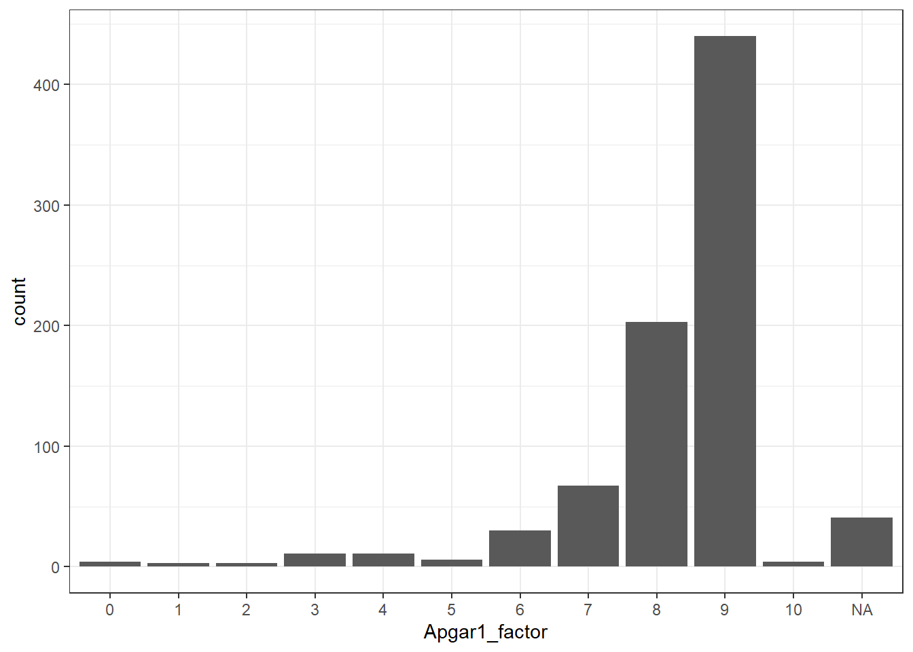
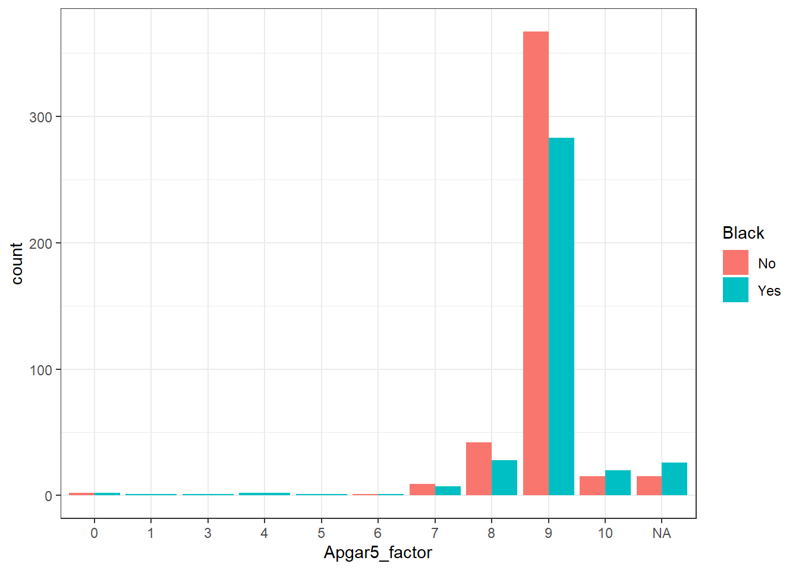

# Data Summaries {#session-2-1}

## Intended Learning Outcomes {#ilo-summaries}

By the end of this chapter you should be able to:

* Calculate descriptive statistics for a range of data types
* Manage missing values

## Reading

Before you work through this chapter, read [Data Organization in Spreadsheets](https://www-tandfonline-com.ezproxy.lib.gla.ac.uk/doi/full/10.1080/00031305.2017.1375989).

## Walkthrough video

We encourage you to read the workbook and attempt each step on your own before watching the video as this will help consolidate your learning.

<iframe width="560" height="315" src="https://www.youtube.com/embed/euuAGl6uCVo" title="YouTube video player" frameborder="0" allow="accelerometer; autoplay; clipboard-write; encrypted-media; gyroscope; picture-in-picture" allowfullscreen></iframe>

## Set-up

Open your course project and do the following:

* Create and save a new R Markdown document named `chapter_5.Rmd` get rid of the default template text from line 11 onwards.
* Add the below code to the set-up chunk and then run the code to load the packages and data.


```r
library(tidyverse)
library(patchwork)
library(psych)
library(medicaldata)
data("opt")
```

For this chapter, we're going to use the `opt` dataset from the `medicaldata` package that contains data on an RCT looking at whether treatment of maternal periodontal disease can reduce risk of preterm birth and low birth weight. There are a lot of variables in this dataset, use `?opt` to find out more about what they mean. 

## Counting groups

For categorical variables, the only descriptive statistic we can calculate is a count. The code below uses the `%>%` operator and can be read as:

-   Start with the dataset `opt` *and then;*

-   Group it by the variable `Black` *and then;*

-   Count the number of observations in each group *and then;*

-   Remove the grouping


```r
opt %>%
  group_by(Black) %>%
  count() %>%
  ungroup()
```

<table>
 <thead>
  <tr>
   <th style="text-align:center;"> Black </th>
   <th style="text-align:center;"> n </th>
  </tr>
 </thead>
<tbody>
  <tr>
   <td style="text-align:center;"> No </td>
   <td style="text-align:center;"> 451 </td>
  </tr>
  <tr>
   <td style="text-align:center;"> Yes </td>
   <td style="text-align:center;"> 372 </td>
  </tr>
</tbody>
</table>


`group_by()` does not result in surface level changes to the dataset, rather, it changes the underlying structure so that if groups are specified, whatever functions called next are performed separately on each level of the grouping variable. This grouping remains in the object that is created so it is important to remove it with `ungroup()` to avoid future operations on the object unknowingly being performed by groups. 

The above code therefore counts the number of observations in each group of the variable `Black`. If you just need the total number of observations, you could remove the `group_by()` and `ungroup()` lines, which would perform the operation on the whole dataset, rather than by groups:


```r
opt %>%
  count()
```

<table>
 <thead>
  <tr>
   <th style="text-align:center;"> n </th>
  </tr>
 </thead>
<tbody>
  <tr>
   <td style="text-align:center;"> 823 </td>
  </tr>
</tbody>
</table>

## Summarise

For numeric data, we can use an increased range of functions. For example, we may wish to calculate the mean age (and SD) of the sample and we can do so using the function `summarise()` from the `dplyr` tidyverse package.


```r
opt %>%
  summarise(mean_age = mean(Age),
            sd_age = sd(Age),
            n_values = n())
```

<table>
 <thead>
  <tr>
   <th style="text-align:center;"> mean_age </th>
   <th style="text-align:center;"> sd_age </th>
   <th style="text-align:center;"> n_values </th>
  </tr>
 </thead>
<tbody>
  <tr>
   <td style="text-align:center;"> 25.98 </td>
   <td style="text-align:center;"> 5.57 </td>
   <td style="text-align:center;"> 823 </td>
  </tr>
</tbody>
</table>

This code produces summary data in the form of a column named `mean_age` that contains the result of calculating the mean of the variable `age`. It then creates `sd_age` which does the same but for standard deviation. Finally, it uses the function `n()` to add the number of values used to calculate the statistic in a column named `n_values` - this is a useful sanity check whenever you make summary statistics.

Note that the above code will not save the result of this operation, it will simply output the result in the console. If you wish to save it for future use, you can store it in an object by using the `<-` notation and print it later by typing the object name.


```r
age_stats <- opt %>%
  summarise(mean_age = mean(Age),
            sd_age = sd(Age),
            n_values = n())
```

Finally, the `group_by()` function will work in the same way when calculating summary statistics -- the output of the function that is called after `group_by()` will be produced for each level of the grouping variable.


```r
opt %>%
  group_by(Black) %>%
  summarise(mean_age = mean(Age),
            sd_age = sd(Age),
            n_values = n()) %>%
  ungroup()
```

<table>
 <thead>
  <tr>
   <th style="text-align:center;"> Black </th>
   <th style="text-align:center;"> mean_age </th>
   <th style="text-align:center;"> sd_age </th>
   <th style="text-align:center;"> n_values </th>
  </tr>
 </thead>
<tbody>
  <tr>
   <td style="text-align:center;"> No </td>
   <td style="text-align:center;"> 26.11 </td>
   <td style="text-align:center;"> 5.50 </td>
   <td style="text-align:center;"> 451 </td>
  </tr>
  <tr>
   <td style="text-align:center;"> Yes </td>
   <td style="text-align:center;"> 25.82 </td>
   <td style="text-align:center;"> 5.65 </td>
   <td style="text-align:center;"> 372 </td>
  </tr>
</tbody>
</table>

## Pipes {#pipes-first}

Before we go further, let's take a quick detour to formally introduce the <a class='glossary' target='_blank' title='A way to order your code in a more readable format using the symbol %>%' href='https://psyteachr.github.io/glossary/p#pipe'>pipe</a>. Pipes allow you to send the output from one function straight into another function. Specifically, they send the result of the function before `%>%` to be the first argument of the function after `%>%`. It can be useful to translate the pipe as "**and then**". It's easier to show than tell, so let's look at an example.


```r
# without pipe
summarise(opt,
          mean_bmi = mean(BMI), 
          median_bmi = median(BMI))

# with pipe
opt %>%
  summarise(mean_bmi = mean(BMI), 
          median_bmi = median(BMI))
```

Notice that `summarise()` no longer needs the first argument to be the data table, it is pulled in from the pipe. The power of the pipe may not be obvious now, but it will soon prove its worth. 

## Alternatives

The method we've used above is pure <code class='package'>tidyverse</code>. The good thing about this approach is that the output it creates is easy to work with and can be used with a range of different functions (for example, you can calculate a table of descriptives and then use this as the data set for a ggplot). However, there are lots of alternatives and they're useful to know because a) you'll see them when you try to Google for help and b) some of them are easier or have additional functionality.

### Base R

Rather than embedding the functions within `summarise()` you can call the summary functions straight from Base R. Let's also clear up what that `$` notation is doing. The dollar sign allows you to select items from an object, such as columns from a table. The left-hand side is the object, and the right-hand side is the item. So in the below code, we're calculating the mean of the `Age` column that is present in the data set `opt`.


```r
mean(opt$Age)
median(opt$Age)
```

```
## [1] 25.97813
## [1] 25
```

Base R also contains the function `summary()` which will print a summary of all the variables in the dataset (actually there's so many variables in this dataset it will omit a few but we'll ignore that for now). `summary()` is very useful for getting a quick overview of the dataset and to check for any potential problems, e.g., do the minimum and maximum values look right? Does any variable have missing data (NAs)?


```r
summary(opt)
```

### psych::describe()

The function `describe()` from the <code class='package'>psych</code> is incredibly useful because it quickly produces a range of descriptive statistics, including standard error which is otherwise a faff to compute in R because there is no base function for standard error like there is for e.g., `sd()`.

By default, `describe()` computes stats for all variables in the data set which probably isn't what you need and in the case of this dataset, would produce a monstrously long output. Instead, we can use `select()` from the <code class='package'>tidyverse</code> to select the columns we want to describe and then pass these to `describe()`. We may also want to drop some of the columns in the default `describe()` table which we can again do with `select()` - hopefully the power of the `%>%` begins to be obvious.


```r
describe_table <- opt %>%
  select(Age, BMI)%>%
  describe() %>%
  select(-vars)
```

<table>
 <thead>
  <tr>
   <th style="text-align:left;">   </th>
   <th style="text-align:center;"> n </th>
   <th style="text-align:center;"> mean </th>
   <th style="text-align:center;"> sd </th>
   <th style="text-align:center;"> median </th>
   <th style="text-align:center;"> trimmed </th>
   <th style="text-align:center;"> mad </th>
   <th style="text-align:center;"> min </th>
   <th style="text-align:center;"> max </th>
   <th style="text-align:center;"> range </th>
   <th style="text-align:center;"> skew </th>
   <th style="text-align:center;"> kurtosis </th>
   <th style="text-align:center;"> se </th>
  </tr>
 </thead>
<tbody>
  <tr>
   <td style="text-align:left;"> Age </td>
   <td style="text-align:center;"> 823 </td>
   <td style="text-align:center;"> 25.97813 </td>
   <td style="text-align:center;"> 5.565973 </td>
   <td style="text-align:center;"> 25 </td>
   <td style="text-align:center;"> 25.60546 </td>
   <td style="text-align:center;"> 5.9304 </td>
   <td style="text-align:center;"> 16 </td>
   <td style="text-align:center;"> 44 </td>
   <td style="text-align:center;"> 28 </td>
   <td style="text-align:center;"> 0.5953557 </td>
   <td style="text-align:center;"> -0.2496268 </td>
   <td style="text-align:center;"> 0.1940176 </td>
  </tr>
  <tr>
   <td style="text-align:left;"> BMI </td>
   <td style="text-align:center;"> 750 </td>
   <td style="text-align:center;"> 27.66933 </td>
   <td style="text-align:center;"> 7.127299 </td>
   <td style="text-align:center;"> 26 </td>
   <td style="text-align:center;"> 26.85667 </td>
   <td style="text-align:center;"> 5.9304 </td>
   <td style="text-align:center;"> 15 </td>
   <td style="text-align:center;"> 68 </td>
   <td style="text-align:center;"> 53 </td>
   <td style="text-align:center;"> 1.4782667 </td>
   <td style="text-align:center;"> 3.6821212 </td>
   <td style="text-align:center;"> 0.2602522 </td>
  </tr>
</tbody>
</table>


Finally, because `describe()` isn't tidyverse, we can't use `group_by()` with it however, there is also a grouped version, `describeBy()`. 


```r
describebytable <- opt %>%
  select(Group, Age, BMI) %>%
  describeBy(group = "Group") 

describebytable
```

```
## 
##  Descriptive statistics by group 
## Group: C
##        vars   n  mean   sd median trimmed  mad min max range skew kurtosis   se
## Group*    1 410  1.00 0.00      1    1.00 0.00   1   1     0  NaN      NaN 0.00
## Age       2 410 25.86 5.51     25   25.48 5.93  16  44    28 0.61    -0.27 0.27
## BMI       3 375 27.45 6.88     26   26.78 5.93  16  62    46 1.16     2.16 0.36
## ------------------------------------------------------------ 
## Group: T
##        vars   n  mean   sd median trimmed  mad min max range skew kurtosis   se
## Group*    1 413  2.00 0.00      2    2.00 0.00   2   2     0  NaN      NaN 0.00
## Age       2 413 26.09 5.62     25   25.73 5.93  16  44    28 0.58    -0.25 0.28
## BMI       3 375 27.89 7.37     26   26.94 5.93  15  68    53 1.72     4.67 0.38
```

The object this creates is different to what we've created so far. Rather than a single data frame or tibble, this creates a <a class='glossary' target='_blank' title='A container data type that allows items with different data types to be grouped together.' href='https://psyteachr.github.io/glossary/l#list'>list</a>. Lists can contain multiple objects, datasets, and data types but it does mean they're a little bit harder to work with and we need to use the `$` notation to pull out specific objects in the list before we can manipulate them. The tab autocomplete function can be very useful here to help you get the name of each object exactly right.


```r
describebytable$C
```

<div class="kable-table">

<table>
 <thead>
  <tr>
   <th style="text-align:left;">   </th>
   <th style="text-align:right;"> vars </th>
   <th style="text-align:right;"> n </th>
   <th style="text-align:right;"> mean </th>
   <th style="text-align:right;"> sd </th>
   <th style="text-align:right;"> median </th>
   <th style="text-align:right;"> trimmed </th>
   <th style="text-align:right;"> mad </th>
   <th style="text-align:right;"> min </th>
   <th style="text-align:right;"> max </th>
   <th style="text-align:right;"> range </th>
   <th style="text-align:right;"> skew </th>
   <th style="text-align:right;"> kurtosis </th>
   <th style="text-align:right;"> se </th>
  </tr>
 </thead>
<tbody>
  <tr>
   <td style="text-align:left;"> Group* </td>
   <td style="text-align:right;"> 1 </td>
   <td style="text-align:right;"> 410 </td>
   <td style="text-align:right;"> 1.00000 </td>
   <td style="text-align:right;"> 0.000000 </td>
   <td style="text-align:right;"> 1 </td>
   <td style="text-align:right;"> 1.00000 </td>
   <td style="text-align:right;"> 0.0000 </td>
   <td style="text-align:right;"> 1 </td>
   <td style="text-align:right;"> 1 </td>
   <td style="text-align:right;"> 0 </td>
   <td style="text-align:right;"> NaN </td>
   <td style="text-align:right;"> NaN </td>
   <td style="text-align:right;"> 0.0000000 </td>
  </tr>
  <tr>
   <td style="text-align:left;"> Age </td>
   <td style="text-align:right;"> 2 </td>
   <td style="text-align:right;"> 410 </td>
   <td style="text-align:right;"> 25.86341 </td>
   <td style="text-align:right;"> 5.512456 </td>
   <td style="text-align:right;"> 25 </td>
   <td style="text-align:right;"> 25.48171 </td>
   <td style="text-align:right;"> 5.9304 </td>
   <td style="text-align:right;"> 16 </td>
   <td style="text-align:right;"> 44 </td>
   <td style="text-align:right;"> 28 </td>
   <td style="text-align:right;"> 0.6055722 </td>
   <td style="text-align:right;"> -0.2681729 </td>
   <td style="text-align:right;"> 0.2722408 </td>
  </tr>
  <tr>
   <td style="text-align:left;"> BMI </td>
   <td style="text-align:right;"> 3 </td>
   <td style="text-align:right;"> 375 </td>
   <td style="text-align:right;"> 27.45333 </td>
   <td style="text-align:right;"> 6.880363 </td>
   <td style="text-align:right;"> 26 </td>
   <td style="text-align:right;"> 26.78073 </td>
   <td style="text-align:right;"> 5.9304 </td>
   <td style="text-align:right;"> 16 </td>
   <td style="text-align:right;"> 62 </td>
   <td style="text-align:right;"> 46 </td>
   <td style="text-align:right;"> 1.1588828 </td>
   <td style="text-align:right;"> 2.1636486 </td>
   <td style="text-align:right;"> 0.3553004 </td>
  </tr>
</tbody>
</table>

</div>

If you want to get rid of the row that contains `Group` (because the descriptives aren't informative) and the `vars` column (which again, isn't hugely helpful), then it requires a little bit of extra wrangling. Using the `%>%` pipe, we pass the table to `filter()` and ask it to return all rows where `vars` does not (`!=`) equal 1 and then we use `select()` to drop (`-`) the column `vars`.


```r
describebytable$`C` %>%
  filter(vars != 1) %>%
  select(-vars)
```

<div class="kable-table">

<table>
 <thead>
  <tr>
   <th style="text-align:left;">   </th>
   <th style="text-align:right;"> n </th>
   <th style="text-align:right;"> mean </th>
   <th style="text-align:right;"> sd </th>
   <th style="text-align:right;"> median </th>
   <th style="text-align:right;"> trimmed </th>
   <th style="text-align:right;"> mad </th>
   <th style="text-align:right;"> min </th>
   <th style="text-align:right;"> max </th>
   <th style="text-align:right;"> range </th>
   <th style="text-align:right;"> skew </th>
   <th style="text-align:right;"> kurtosis </th>
   <th style="text-align:right;"> se </th>
  </tr>
 </thead>
<tbody>
  <tr>
   <td style="text-align:left;"> Age </td>
   <td style="text-align:right;"> 410 </td>
   <td style="text-align:right;"> 25.86341 </td>
   <td style="text-align:right;"> 5.512456 </td>
   <td style="text-align:right;"> 25 </td>
   <td style="text-align:right;"> 25.48171 </td>
   <td style="text-align:right;"> 5.9304 </td>
   <td style="text-align:right;"> 16 </td>
   <td style="text-align:right;"> 44 </td>
   <td style="text-align:right;"> 28 </td>
   <td style="text-align:right;"> 0.6055722 </td>
   <td style="text-align:right;"> -0.2681729 </td>
   <td style="text-align:right;"> 0.2722408 </td>
  </tr>
  <tr>
   <td style="text-align:left;"> BMI </td>
   <td style="text-align:right;"> 375 </td>
   <td style="text-align:right;"> 27.45333 </td>
   <td style="text-align:right;"> 6.880363 </td>
   <td style="text-align:right;"> 26 </td>
   <td style="text-align:right;"> 26.78073 </td>
   <td style="text-align:right;"> 5.9304 </td>
   <td style="text-align:right;"> 16 </td>
   <td style="text-align:right;"> 62 </td>
   <td style="text-align:right;"> 46 </td>
   <td style="text-align:right;"> 1.1588828 </td>
   <td style="text-align:right;"> 2.1636486 </td>
   <td style="text-align:right;"> 0.3553004 </td>
  </tr>
</tbody>
</table>

</div>

## Ordinal data

Sometimes you will data that is represented as numbers, but is really ordinal data. The `opt` data contains data relating to the Apgar score, which the help documentation and Google tells me is a summary of a newborn infant's 'Appearance, Pulse, Grimace, Activity, Respiration' at 1 minute. For each trait, a score of 0, 1, or 2 is assigned. For example:

Grimace response or reflex irritability is a term describing response to stimulation, such as a mild pinch:

* If there is no reaction, the infant scores 0 for reflex irritability.
* If there is grimacing, the infant scores 1 for reflex irritability.
* If there is grimacing and a cough, sneeze, or vigorous cry, the infant scores 2 for reflex irritability.

The scores for all traits are then added up:

* Less than or equal to 3: Critically low 
* 4-6: Fairly low 
* greater than or equal to 7: Normal

So whilst this looks like a number, it's really not because you can't be sure that the difference between a score of 0 and 1 is the same as the difference between 1 and 2. But currently, R doesn't know this, as far as R is concerned, if it looks like a number and walks like a number and smells like a number, it's going to treat it as a number.


```r
opt %>%
  select(Apgar1, Apgar5) %>%
  describe()
```

<div class="kable-table">

<table>
 <thead>
  <tr>
   <th style="text-align:left;">   </th>
   <th style="text-align:right;"> vars </th>
   <th style="text-align:right;"> n </th>
   <th style="text-align:right;"> mean </th>
   <th style="text-align:right;"> sd </th>
   <th style="text-align:right;"> median </th>
   <th style="text-align:right;"> trimmed </th>
   <th style="text-align:right;"> mad </th>
   <th style="text-align:right;"> min </th>
   <th style="text-align:right;"> max </th>
   <th style="text-align:right;"> range </th>
   <th style="text-align:right;"> skew </th>
   <th style="text-align:right;"> kurtosis </th>
   <th style="text-align:right;"> se </th>
  </tr>
 </thead>
<tbody>
  <tr>
   <td style="text-align:left;"> Apgar1 </td>
   <td style="text-align:right;"> 1 </td>
   <td style="text-align:right;"> 782 </td>
   <td style="text-align:right;"> 8.170077 </td>
   <td style="text-align:right;"> 1.4474932 </td>
   <td style="text-align:right;"> 9 </td>
   <td style="text-align:right;"> 8.493610 </td>
   <td style="text-align:right;"> 0 </td>
   <td style="text-align:right;"> 0 </td>
   <td style="text-align:right;"> 10 </td>
   <td style="text-align:right;"> 10 </td>
   <td style="text-align:right;"> -2.799608 </td>
   <td style="text-align:right;"> 9.506705 </td>
   <td style="text-align:right;"> 0.0517623 </td>
  </tr>
  <tr>
   <td style="text-align:left;"> Apgar5 </td>
   <td style="text-align:right;"> 2 </td>
   <td style="text-align:right;"> 782 </td>
   <td style="text-align:right;"> 8.824808 </td>
   <td style="text-align:right;"> 0.9143883 </td>
   <td style="text-align:right;"> 9 </td>
   <td style="text-align:right;"> 8.969649 </td>
   <td style="text-align:right;"> 0 </td>
   <td style="text-align:right;"> 0 </td>
   <td style="text-align:right;"> 10 </td>
   <td style="text-align:right;"> 10 </td>
   <td style="text-align:right;"> -6.402171 </td>
   <td style="text-align:right;"> 53.453558 </td>
   <td style="text-align:right;"> 0.0326985 </td>
  </tr>
</tbody>
</table>

</div>


```r
opt %>%
  select(Apgar1, Apgar5) %>%
  summary()
```

```
##      Apgar1          Apgar5      
##  Min.   : 0.00   Min.   : 0.000  
##  1st Qu.: 8.00   1st Qu.: 9.000  
##  Median : 9.00   Median : 9.000  
##  Mean   : 8.17   Mean   : 8.825  
##  3rd Qu.: 9.00   3rd Qu.: 9.000  
##  Max.   :10.00   Max.   :10.000  
##  NA's   :41      NA's   :41
```


If medical researchers are anything like psychologists, they will ignore the fact that the Apgar score is ordinal, treat it like a real number, calculate a full range of descriptive statistics and use it in parametric statistical tests. However, this isn't really right. 

Instead, you can convert the variable to a <a class='glossary' target='_blank' title='A data type where a specific set of values are stored with labels; An explanatory variable manipulated by the experimenter' href='https://psyteachr.github.io/glossary/f#factor'>factor</a>, or category using the function `mutate()` from the <code class='package'>tidyverse</code> package <code class='package'>dplyr</code>.

Note that because we save the result of the operation to a dataset of the same name, it will overwrite the original object. In this example, we've chosen to create new variables with the factored data but we could also have chosen to overwrite the original `Apgar1` and `Apgar5` variables by providing the existing names on the left-hand side. Think carefully about whether you want to overwrite existing variables or create new ones.


```r
opt <- opt %>%
  mutate(Apgar1_factor = as.factor(Apgar1),
         Apgar5_factor = as.factor(Apgar5))
```

Now that these variables are categories, `summary()` provides counts rather than means etc:


```r
opt %>%
  select(Apgar1_factor, Apgar5_factor) %>%
  summary()
```

```
##  Apgar1_factor Apgar5_factor
##  9      :440   9      :650  
##  8      :203   8      : 70  
##  7      : 67   10     : 35  
##  6      : 30   7      : 16  
##  3      : 11   0      :  4  
##  (Other): 31   (Other):  7  
##  NA's   : 41   NA's   : 41
```

You can also use `ggplot()` to plot the number of babies with each score:


```r
ggplot(opt, aes(x = Apgar1_factor)) +
  geom_bar()
```



Or use the factor as a new grouping variable:


```r
ggplot(opt, aes(x = Apgar5_factor, fill = Black)) +
  geom_bar(position = "dodge")
```



## Missing values

#### Ignore missing values

Some of the variables have missing data. If we try and compute mean BMI it  returns `NA`. This is because `NA` basically means "I don't know", and the sum of 100 and "I don't know" is "I don't know", not 100. However, when you're calculating means, you often want to just ignore missing values. Set `na.rm = TRUE` in the summary function to remove missing values before calculating.


```r
# code that will return NA
opt %>%
  summarise(mean_bmi = mean(BMI))

# ignore missing values to return mean
opt %>%
  summarise(mean_bmi = mean(BMI, na.rm = TRUE))
```

<div class="kable-table">

<table>
 <thead>
  <tr>
   <th style="text-align:right;"> mean_bmi </th>
  </tr>
 </thead>
<tbody>
  <tr>
   <td style="text-align:right;"> NA </td>
  </tr>
</tbody>
</table>

</div><div class="kable-table">

<table>
 <thead>
  <tr>
   <th style="text-align:right;"> mean_bmi </th>
  </tr>
 </thead>
<tbody>
  <tr>
   <td style="text-align:right;"> 27.66933 </td>
  </tr>
</tbody>
</table>

</div>

#### Count missing values

If you want to find out how many missing or non-missing values there are in a column, use the `is.na()` function to get a <a class='glossary' target='_blank' title='A data type representing TRUE or FALSE values.' href='https://psyteachr.github.io/glossary/l#logical'>logical</a> vector of whether or not each value is missing, and use `sum()` to count how many values are TRUE or `mean()` to calculate the proportion of TRUE values.


```r
opt %>%
  group_by(Black) %>%
  summarise(
    n_valid = sum(!is.na(Apgar5_factor)),
    n_missing = sum(is.na(Apgar5_factor)),
    prop_missing = mean(is.na(Apgar5_factor))
  )
```

<div class="kable-table">

<table>
 <thead>
  <tr>
   <th style="text-align:left;"> Black </th>
   <th style="text-align:right;"> n_valid </th>
   <th style="text-align:right;"> n_missing </th>
   <th style="text-align:right;"> prop_missing </th>
  </tr>
 </thead>
<tbody>
  <tr>
   <td style="text-align:left;"> No </td>
   <td style="text-align:right;"> 436 </td>
   <td style="text-align:right;"> 15 </td>
   <td style="text-align:right;"> 0.0332594 </td>
  </tr>
  <tr>
   <td style="text-align:left;"> Yes </td>
   <td style="text-align:right;"> 346 </td>
   <td style="text-align:right;"> 26 </td>
   <td style="text-align:right;"> 0.0698925 </td>
  </tr>
</tbody>
</table>

</div>

#### Omit missing values

You may also want to remove rows that have missing values and only work from complete datasets. `drop_na()` will remove any row that has a missing observation. You can use `drop_na()` on the entire dataset which will remove any row that has *any* missing value, or you can specify to only remove rows that are missing a specific value.


```r
# remove any rows with any missing values
complete_data <- opt %>%
  drop_na()

# remove any rows that are missing a value for sales
complete_bmi <- opt %>%
  drop_na(BMI)
```

Missing data can be quite difficult to deal with depending on how it is represented. As always, no amount of coding expertise can make up for not understanding the structure and idiosyncrasies of your data. 

## Glossary {#glossary-summary}

<table class="table" style="margin-left: auto; margin-right: auto;">
 <thead>
  <tr>
   <th style="text-align:left;"> term </th>
   <th style="text-align:left;"> definition </th>
  </tr>
 </thead>
<tbody>
  <tr>
   <td style="text-align:left;"> [factor](https://psyteachr.github.io/glossary/f.html#factor){class="glossary" target="_blank"} </td>
   <td style="text-align:left;"> A data type where a specific set of values are stored with labels; An explanatory variable manipulated by the experimenter </td>
  </tr>
  <tr>
   <td style="text-align:left;"> [list](https://psyteachr.github.io/glossary/l.html#list){class="glossary" target="_blank"} </td>
   <td style="text-align:left;"> A container data type that allows items with different data types to be grouped together. </td>
  </tr>
  <tr>
   <td style="text-align:left;"> [logical](https://psyteachr.github.io/glossary/l.html#logical){class="glossary" target="_blank"} </td>
   <td style="text-align:left;"> A data type representing TRUE or FALSE values. </td>
  </tr>
  <tr>
   <td style="text-align:left;"> [pipe](https://psyteachr.github.io/glossary/p.html#pipe){class="glossary" target="_blank"} </td>
   <td style="text-align:left;"> A way to order your code in a more readable format using the symbol %&gt;% </td>
  </tr>
</tbody>
</table>


## Further resources {#resources-summary}

* [Data transformation cheat sheet](https://raw.githubusercontent.com/rstudio/cheatsheets/main/data-transformation.pdf)
* [Chapter 5: Data Transformation ](http://r4ds.had.co.nz/transform.html) in *R for Data Science*
* [Tidy Text](https://www.tidytextmining.com/index.html)


