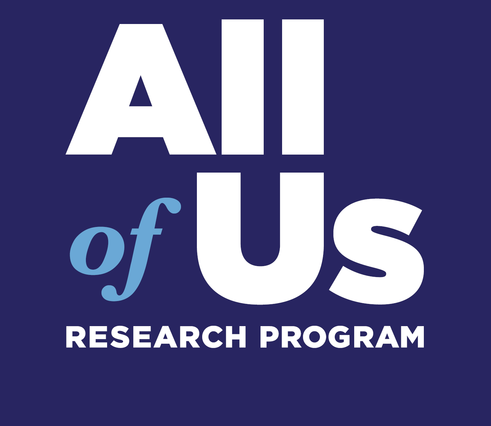

--- 
title: "Intro to R and Data Visualization" # edit
#subtitle: "optional" 
author: "Emily Nordmann & Javan Carter" # edit
date: "2023-09-03"
site: bookdown::bookdown_site
documentclass: book
classoption: oneside # for PDFs
geometry: margin=1in # for PDFs
bibliography: [book.bib, packages.bib]
csl: include/apa.csl
link-citations: yes
description: | # edit
  The accompanying book for the *All of Us* Research Program Intro to R and Data Visualization course.
url: https://emilynordmann.github.io/AllOfUs-intro-to-r # edit
github-repo: emilynordmann/AllOfUs-intro-to-r # edit
cover-image: images/logos/logo.png # replace with your logo
apple-touch-icon: images/logos/apple-touch-icon.png # replace with your logo
apple-touch-icon-size: 180
---

# Introduction {-}

This course is designed to be completed over approximately three weeks. For the first two weeks, there are several chapters of this workbook to work through asynchronously with an accompanying walkthrough video and suggested reading list. The time it takes to work through each chapter will vary considerably depending on your previous experience with R and programming. 

For complete novices, we estimate that each chapter will take between 1-2 hours and that you will likely want or need to watch the walkthrough video in full. Those with more experience with programming will likely take less time and for you we have included links to further resources so that you can go beyond the core material provided in this course.

In addition to the asynchronous content, there will be two live office hour sessions in Week 2 and 3. In these sessions, your instructors will answer questions about the content covered in this workbook and how to apply it to using the *All of Us* Researcher Workbench, as well as conducting quizzes to help consolidate your learning. Finally, to complete the course, there will be a 20-item multiple-choice quiz.

## Instructors

**Dr. Emily Nordmann** is a teaching-focused Senior Lecturer in the [School of Psychology and Neuroscience](https://www.gla.ac.uk/schools/psychologyneuroscience/) at the University of Glasgow. She teaches research methods, individual differences and data skills in R as well as acting as Deputy Director of Education. She is a vocal advocate of open science and open educational resources. As a member of the [PsyTeachR](https://psyteachr.github.io/) team she has authored several open-access data skills books and tutorials. She lives in Glasgow, Scotland with her wife Kathleen and her cat Khaleesi, who she named before the final season of Game of Thrones aired. 

     
**Dr. Javan K. Carter** is a bioinformaticist at RTI International. He researches genomic and transcriptomic data to understand genotype- phenotype correlation and genetic architecture of complex traits and diseases. Within RTI, he is the lead and co-lead informatics scientist for several projects and assists in a number of projects associated with various data types. He is also an evolutionary genomicist by training. He uses bash, JavaScript, and R as primary coding languages. He loves to teach and educate people on the wonders of computational biology and introduce people to coding for the first time!

## Progress Tracker {#progress}

This course is designed to be completed over approximately three weeks. To help you plan your time and to keep on track, we have provided a Progress Tracker checklist that details what you need to do and when you need to do it by.

* Download the Progress Tracker as a [Word document](course_materials/progress_tracker.docx)
* Download the Progress Tracker as a [PDF](course_materials/progress_tracker.pdf)

## Course Overview

This video gives an overview of the course syllabus and requirements. It is important that you watch this video before starting the course.

* Download the Course Overview [PowerPoint slides](course_materials/course_overview.pptx)

<iframe width="560" height="315" src="https://www.youtube.com/embed/PpByWITwfqI" title="YouTube video player" frameborder="0" allow="accelerometer; autoplay; clipboard-write; encrypted-media; gyroscope; picture-in-picture" allowfullscreen></iframe>

     
